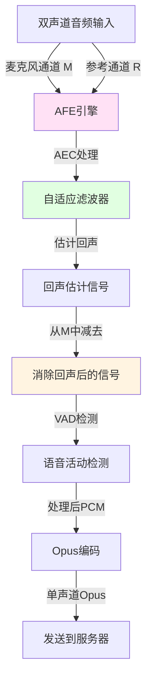
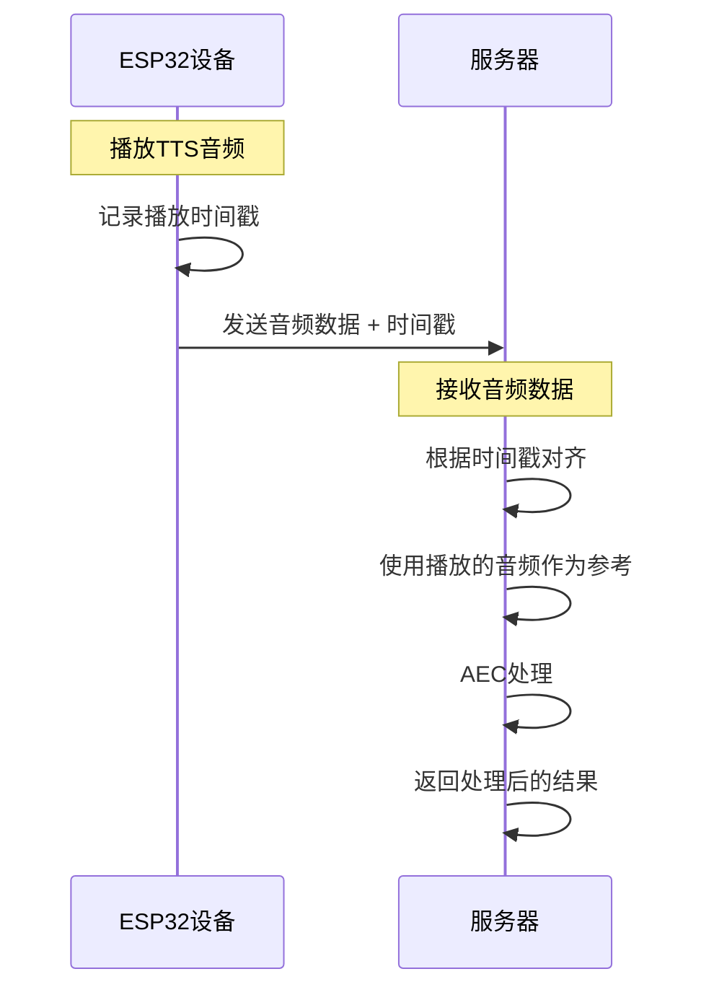

# AEC (回声消除) 实现原理详解

本文档详细说明设备端 AEC 和服务端 AEC 的区别、实现原理和使用场景。

## 1. AEC 概述

### 1.1 什么是 AEC？

**AEC (Acoustic Echo Cancellation, 回声消除)** 是一种音频处理技术，用于消除扬声器播放的声音被麦克风重新采集而产生的回声。

### 1.2 ESP-SR 和 AFE 简介

**ESP-SR (Espressif Speech Recognition)**

- 乐鑫科技（Espressif）开发的语音识别框架
- 提供离线语音识别、唤醒词检测等功能
- 项目依赖：`espressif/esp-sr: ~2.2.0`

**AFE (Audio Front-End, 音频前端)**

- ESP-SR 框架中的核心音频处理引擎
- 全称：**Audio Front-End**（音频前端），中文称为"声学前端"
- 提供多种音频处理算法的统一接口：
  - **AEC (Acoustic Echo Cancellation)**：回声消除
  - **NS (Noise Suppression)**：噪声抑制
  - **VAD (Voice Activity Detection)**：语音活动检测
  - **BSS (Blind Source Separation)**：盲源分离（可选）

**AFE 引擎的作用：**

- 提供高质量的音频预处理
- 提升语音识别在远场噪声环境中的性能
- 支持单声道和双声道音频处理
- 优化 ESP32 平台的实时音频处理性能

**项目中的使用：**

```cpp
// 使用 AFE 引擎进行音频处理
#include <esp_afe_sr_models.h>

// AFE 接口类型
const esp_afe_sr_iface_t* afe_iface_;  // AFE 接口
esp_afe_sr_data_t* afe_data_;          // AFE 数据句柄

// 初始化 AFE 配置
afe_config_t* afe_config = afe_config_init(...);
afe_iface_ = esp_afe_handle_from_config(afe_config);
afe_data_ = afe_iface_->create_from_config(afe_config);
```

**参考文档：**

- [ESP-SR 官方文档](https://github.com/espressif/esp-sr)
- [AFE 声学前端算法框架](https://docs.espressif.com/projects/esp-sr/zh_CN/latest/esp32/audio_front_end/README.html)

### 1.2 回声产生的原因

```
用户说话 → 麦克风采集 → 发送到服务器 → TTS播放 → 扬声器输出
                                                      ↓
                                             麦克风重新采集 ← 形成回声
```

在语音交互场景中，当设备播放 TTS 音频时，这些声音会被麦克风重新采集，形成回声，影响语音识别质量。

## 2. 设备端 AEC vs 服务端 AEC

### 2.1 对比表

| 特性         | 设备端 AEC                        | 服务端 AEC                   |
| ------------ | --------------------------------- | ---------------------------- |
| **处理位置** | ESP32 设备本地                    | 服务器端                     |
| **硬件要求** | 需要双声道输入（麦克风+参考通道） | 需要时间戳同步               |
| **处理引擎** | ESP-SR AFE 引擎                   | 服务器端算法                 |
| **延迟**     | 极低（本地处理）                  | 较高（网络传输+处理）        |
| **带宽消耗** | 低（只发送单声道）                | 可能较高（需发送参考信号）   |
| **CPU 占用** | 高（设备端处理）                  | 低（服务器处理）             |
| **效果**     | 较好（实时处理）                  | 取决于服务器实现             |
| **适用场景** | 有参考通道的硬件                  | 无参考通道或需要服务器端处理 |

### 2.2 选择建议

- **设备端 AEC**：适合有双声道音频输入（麦克风+参考通道）的硬件
- **服务端 AEC**：适合单声道输入或需要服务器端统一处理的场景

## 3. 设备端 AEC 实现

### 3.1 硬件要求

设备端 AEC 需要以下硬件支持：

1. **双声道音频输入**

   - 麦克风通道（M）：采集用户语音和环境声音
   - 参考通道（R）：采集扬声器播放的原始信号

2. **物理隔离**

   - 麦克风和扬声器之间需要一定的物理隔离
   - 参考通道需要是"干净"的扬声器信号（未经过房间混响）

3. **支持的板卡**
   - ESP-BOX-3
   - ESP-BOX
   - ESP-BOX-LITE
   - LICHUANG-DEV-S3
   - ESP-KORVO2-V3
   - 部分 Waveshare 板卡
   - 等（详见 `Kconfig.projbuild`）

### 3.2 实现原理



**核心算法：**

1. **自适应滤波器**

   - 使用参考通道（R）估计回声信号
   - 通过自适应算法学习房间声学特性
   - 生成回声估计信号

2. **回声消除**

   - 从麦克风通道（M）中减去估计的回声
   - 得到消除回声后的干净信号

3. **后处理**
   - VAD（语音活动检测）
   - 降噪（可选）

### 3.3 代码实现

#### 3.3.1 初始化配置

```cpp
// main/audio/processors/afe_audio_processor.cc

void AfeAudioProcessor::Initialize(AudioCodec* codec, int frame_duration_ms, srmodel_list_t* models_list) {
    // 检测是否有参考通道
    int ref_num = codec_->input_reference() ? 1 : 0;

    // 构建输入格式字符串
    // 'M' = 麦克风通道, 'R' = 参考通道
    std::string input_format;
    for (int i = 0; i < codec_->input_channels() - ref_num; i++) {
        input_format.push_back('M');  // 麦克风通道
    }
    for (int i = 0; i < ref_num; i++) {
        input_format.push_back('R');  // 参考通道
    }

    // 配置 AFE
    afe_config_t* afe_config = afe_config_init(input_format.c_str(), NULL, AFE_TYPE_VC, AFE_MODE_HIGH_PERF);

#ifdef CONFIG_USE_DEVICE_AEC
    afe_config->aec_init = true;      // 启用 AEC
    afe_config->aec_mode = AEC_MODE_VOIP_HIGH_PERF;  // 高性能模式
    afe_config->vad_init = false;     // 禁用 VAD（AEC 模式下）
#else
    afe_config->aec_init = false;
    afe_config->vad_init = true;      // 启用 VAD
#endif
}
```

**重要说明：为什么 AEC 模式下禁用 VAD？**

在 ESP-SR 的 AFE 引擎中，AEC 和 VAD 是**互斥的**，不能同时启用。原因如下：

1. **资源竞争**：AEC 和 VAD 共享 AFE 引擎的计算资源，同时启用会导致资源冲突
2. **处理流程冲突**：AEC 需要持续处理音频流以学习回声特性，而 VAD 会中断音频流（只在检测到语音时输出）
3. **AEC 内置 VAD**：AEC 模式本身包含语音活动检测功能，不需要单独的 VAD 模块
4. **输出行为不同**：
   - **VAD 模式**：只在检测到语音时输出音频帧，静音时停止输出
   - **AEC 模式**：持续输出处理后的音频帧，无论是否有语音

**注意**：即使 `vad_init = false`，AFE 引擎仍然会在处理结果中提供 VAD 状态信息（`res->vad_state`），代码中仍然可以监听 VAD 状态变化，只是不启用独立的 VAD 处理模块。

#### 3.3.2 数据处理流程

```cpp
// AudioInputTask 读取双声道数据
void AudioService::ReadAudioData(std::vector<int16_t>& data, int sample_rate, int samples) {
    if (codec_->input_channels() == 2) {
        // 分离麦克风通道和参考通道
        auto mic_channel = std::vector<int16_t>(data.size() / 2);
        auto reference_channel = std::vector<int16_t>(data.size() / 2);
        for (size_t i = 0, j = 0; i < mic_channel.size(); ++i, j += 2) {
            mic_channel[i] = data[j];           // 左声道：麦克风
            reference_channel[i] = data[j + 1];  // 右声道：参考
        }

        // 重采样到 16kHz
        // ...

        // 重新组合为交错格式
        data.resize(resampled_mic.size() + resampled_reference.size());
        for (size_t i = 0, j = 0; i < resampled_mic.size(); ++i, j += 2) {
            data[j] = resampled_mic[i];
            data[j + 1] = resampled_reference[i];
        }
    }
}

// 将数据送入 AFE 引擎
void AfeAudioProcessor::Feed(std::vector<int16_t>&& data) {
    // data 包含交错的双声道数据：[M0, R0, M1, R1, ...]
    afe_iface_->feed(afe_data_, data.data());
}

// AFE 引擎在后台任务中处理
void AfeAudioProcessor::AudioProcessorTask() {
    while (true) {
        // 从 AFE 引擎获取处理后的数据
        auto res = afe_iface_->fetch_with_delay(afe_data_, portMAX_DELAY);

        // res->data 是消除回声后的单声道 PCM 数据
        if (output_callback_) {
            output_callback_(std::move(processed_data));
        }
    }
}
```

#### 3.3.3 数据流

```
硬件输入（双声道）
  ↓
[麦克风通道 M, 参考通道 R]
  ↓
AFE 引擎 Feed
  ↓
自适应滤波器处理
  ↓
回声消除
  ↓
处理后单声道 PCM
  ↓
Opus 编码
  ↓
发送到服务器（单声道）
```

### 3.4 配置选项

在 `Kconfig.projbuild` 中：

```kconfig
config USE_DEVICE_AEC
    bool "Enable Device-Side AEC"
    default n
    depends on USE_AUDIO_PROCESSOR && (支持的板卡列表)
    help
        To work properly, device-side AEC requires:
        - A clean output reference path from the speaker signal
        - Physical acoustic isolation between the microphone and speaker
```

## 4. 服务端 AEC 实现

### 4.1 硬件要求

服务端 AEC 对硬件要求较低：

1. **单声道或双声道输入均可**

   - 单声道：只发送麦克风信号
   - 双声道：可以发送麦克风+参考通道

2. **时间戳同步**
   - 需要记录音频播放的时间戳
   - 在发送音频数据时携带时间戳

### 4.2 实现原理



**核心原理：**

1. **时间戳同步**

   - 设备记录 TTS 音频播放的时间戳
   - 在发送麦克风数据时携带对应的时间戳
   - 服务器根据时间戳对齐播放的音频和采集的音频

2. **服务器端处理**
   - 服务器知道播放了什么音频（TTS 输出）
   - 使用播放的音频作为参考信号
   - 从麦克风信号中消除回声

### 4.3 代码实现

#### 4.3.1 时间戳记录

```cpp
// main/audio/audio_service.cc

void AudioService::AudioOutputTask() {
    while (true) {
        // 播放音频
        codec_->OutputData(task->pcm);

#if CONFIG_USE_SERVER_AEC
        /* 记录播放时间戳用于服务端 AEC */
        if (task->timestamp > 0) {
            std::lock_guard<std::mutex> lock(audio_queue_mutex_);
            timestamp_queue_.push_back(task->timestamp);
        }
#endif
    }
}
```

#### 4.3.2 时间戳关联

```cpp
// main/audio/audio_service.cc

void AudioService::PushTaskToEncodeQueue(AudioTaskType type, std::vector<int16_t>&& pcm) {
    auto task = std::make_unique<AudioTask>();
    task->type = type;
    task->pcm = std::move(pcm);

    /* 如果是发送队列任务，需要设置时间戳 */
    if (type == kAudioTaskTypeEncodeToSendQueue && !timestamp_queue_.empty()) {
        if (timestamp_queue_.size() <= MAX_TIMESTAMPS_IN_QUEUE) {
            task->timestamp = timestamp_queue_.front();  // 关联播放时间戳
            timestamp_queue_.pop_front();
        }
    }

    audio_encode_queue_.push_back(std::move(task));
}
```

#### 4.3.3 协议支持

**WebSocket 协议（BinaryProtocol2）：**

```cpp
// main/protocols/protocol.h

struct BinaryProtocol2 {
    uint16_t version;
    uint16_t type;          // 0: OPUS, 1: JSON
    uint32_t reserved;
    uint32_t timestamp;     // 时间戳（毫秒，用于服务器端 AEC）
    uint32_t payload_size;
    uint8_t payload[];       // Opus 音频数据
} __attribute__((packed));
```

**MQTT + UDP 协议：**

```cpp
// main/protocols/mqtt_protocol.cc

bool MqttProtocol::SendAudio(std::unique_ptr<AudioStreamPacket> packet) {
    // UDP 数据包格式：
    // |type 1u|flags 1u|payload_len 2u|ssrc 4u|timestamp 4u|sequence 4u|
    // |payload payload_len|

    std::string nonce(aes_nonce_);
    *(uint32_t*)&nonce[8] = htonl(packet->timestamp);  // 设置时间戳
    // ... 加密和发送
}
```

#### 4.3.4 Hello 消息声明

```cpp
// main/protocols/websocket_protocol.cc

std::string WebsocketProtocol::GetHelloMessage() {
    cJSON* features = cJSON_CreateObject();
#if CONFIG_USE_SERVER_AEC
    cJSON_AddBoolToObject(features, "aec", true);  // 声明支持服务端 AEC
#endif
    // ...
}
```

### 4.4 数据流

```
播放TTS音频
  ↓
记录时间戳 T1
  ↓
麦克风采集音频（包含回声）
  ↓
关联时间戳 T1
  ↓
编码为 Opus
  ↓
发送到服务器（包含时间戳）
  ↓
服务器根据时间戳对齐
  ↓
服务器端 AEC 处理
  ↓
返回处理结果
```

## 5. 详细对比

### 5.1 处理流程对比

#### 设备端 AEC


#### 服务端 AEC


### 5.2 数据格式对比

#### 设备端 AEC

- **输入**：双声道 PCM（麦克风 + 参考）
- **处理**：设备端 AFE 引擎
- **输出**：单声道 PCM（已消除回声）
- **发送**：单声道 Opus

#### 服务端 AEC

- **输入**：单声道或双声道 PCM
- **处理**：服务器端算法
- **输出**：处理后的音频
- **发送**：Opus + 时间戳（BinaryProtocol2）

### 5.3 性能对比

| 指标         | 设备端 AEC     | 服务端 AEC          |
| ------------ | -------------- | ------------------- |
| **处理延迟** | ~10-20ms       | ~50-100ms（含网络） |
| **CPU 占用** | 高（~15-20%）  | 低（设备端）        |
| **内存占用** | 高（AFE 引擎） | 低（设备端）        |
| **带宽**     | 低（单声道）   | 中等（含时间戳）    |
| **效果**     | 好（实时处理） | 取决于服务器        |

## 6. 使用场景

### 6.1 设备端 AEC 适用场景

✅ **推荐使用：**

- 有双声道音频输入的硬件
- 对延迟要求极高的场景
- 需要离线处理能力
- 网络带宽受限

❌ **不适用：**

- 单声道音频输入
- CPU 资源紧张
- 内存受限

### 6.2 服务端 AEC 适用场景

✅ **推荐使用：**

- 单声道音频输入
- 需要服务器端统一处理
- 设备端资源受限
- 需要灵活的算法更新

❌ **不适用：**

- 网络延迟高
- 对实时性要求极高
- 离线场景

## 7. 配置和启用

### 7.1 设备端 AEC

```kconfig
# 在 Kconfig.projbuild 中
CONFIG_USE_DEVICE_AEC=y
CONFIG_USE_AUDIO_PROCESSOR=y
```

```cpp
// 在代码中
Application::GetInstance().SetAecMode(kAecOnDeviceSide);
```

### 7.2 服务端 AEC

```kconfig
# 在 Kconfig.projbuild 中
CONFIG_USE_SERVER_AEC=y
CONFIG_USE_AUDIO_PROCESSOR=y
```

```cpp
// 在代码中
Application::GetInstance().SetAecMode(kAecOnServerSide);
```

### 7.3 禁用 AEC

```cpp
Application::GetInstance().SetAecMode(kAecOff);
```

## 8. 注意事项

### 8.1 设备端 AEC

1. **硬件要求严格**

   - 必须有参考通道
   - 参考通道必须是"干净"的扬声器信号
   - 麦克风和扬声器需要物理隔离

2. **资源消耗**

   - 需要 ESP32-S3 或更高性能芯片
   - 需要 PSRAM
   - CPU 占用较高

3. **配置限制**
   - 只能与 `USE_AUDIO_PROCESSOR` 同时启用
   - 不能与 `USE_SERVER_AEC` 同时启用
   - **与 VAD 互斥**：启用 AEC 时必须禁用 VAD（`vad_init = false`）

### 8.3 AEC 与 VAD 的关系详解

#### 为什么 AEC 和 VAD 互斥？

在 ESP-SR 的 AFE 引擎中，AEC 和 VAD 是**互斥的**，不能同时启用。这是由 AFE 引擎的设计决定的：

```cpp
#ifdef CONFIG_USE_DEVICE_AEC
    afe_config->aec_init = true;      // 启用 AEC
    afe_config->vad_init = false;     // 禁用 VAD（AEC 模式下）
#else
    afe_config->aec_init = false;
    afe_config->vad_init = true;      // 启用 VAD
#endif
```

**互斥的原因：**

1. **资源竞争**

   ```
   AFE 引擎计算资源
   ├── AEC 模块（占用大量 CPU 和内存）
   └── VAD 模块（占用大量 CPU 和内存）
   ```

   - 两者共享相同的计算资源池
   - 同时启用会导致资源不足，影响处理性能
   - AFE 引擎设计为单模式运行

2. **处理流程冲突**

   **VAD 模式的行为：**

   ```cpp
   // VAD 模式：只在检测到语音时输出
   if (res->vad_state == VAD_SPEECH) {
       output_callback_(audio_data);  // 有语音时输出
   }
   // 静音时不输出，节省带宽
   ```

   **AEC 模式的行为：**

   ```cpp
   // AEC 模式：持续输出处理后的音频
   output_callback_(processed_audio);  // 总是输出
   // 即使没有语音，也需要输出以学习回声特性
   ```

   - VAD 会中断音频流（静音时不输出）
   - AEC 需要持续处理音频流以学习回声特性
   - 两者处理逻辑冲突

3. **AEC 内置语音检测**

   - AEC 模式本身包含语音活动检测功能
   - 不需要单独的 VAD 模块
   - AEC 的输出结果中仍然包含 VAD 状态信息（`res->vad_state`）

4. **输出行为差异**
   - **VAD 模式**：按需输出（有语音才输出），节省带宽
   - **AEC 模式**：持续输出（总是输出），保证回声消除效果

#### 代码中的实际处理

虽然禁用了 VAD 初始化，但代码仍然可以获取 VAD 状态：

```cpp
// main/audio/processors/afe_audio_processor.cc

// 即使 vad_init = false，AFE 引擎仍然会计算并返回 VAD 状态
if (vad_state_change_callback_) {
    if (res->vad_state == VAD_SPEECH && !is_speaking_) {
        is_speaking_ = true;
        vad_state_change_callback_(true);  // 仍然可以监听 VAD 状态
    } else if (res->vad_state == VAD_SILENCE && is_speaking_) {
        is_speaking_ = false;
        vad_state_change_callback_(false);
    }
}
```

**这意味着：**

- ✅ **可以获取 VAD 状态**：即使 `vad_init = false`，AFE 引擎仍然会计算并返回 VAD 状态
- ❌ **不能启用独立 VAD 模块**：不能同时启用 AEC 和独立的 VAD 处理模块
- ✅ **AEC 内置检测**：AEC 模式本身提供语音活动检测功能

#### 动态切换机制

代码支持运行时动态切换 AEC 和 VAD：

```cpp
// main/audio/processors/afe_audio_processor.cc

void AfeAudioProcessor::EnableDeviceAec(bool enable) {
    if (enable) {
        afe_iface_->disable_vad(afe_data_);  // 先禁用 VAD
        afe_iface_->enable_aec(afe_data_);   // 再启用 AEC
    } else {
        afe_iface_->disable_aec(afe_data_);  // 先禁用 AEC
        afe_iface_->enable_vad(afe_data_);  // 再启用 VAD
    }
}
```

**切换顺序很重要：**

- 必须先禁用一个，再启用另一个
- 避免同时启用导致资源冲突
- 确保状态转换的原子性

#### 总结

| 特性         | VAD 模式            | AEC 模式            |
| ------------ | ------------------- | ------------------- |
| **输出行为** | 只在有语音时输出    | 持续输出            |
| **资源占用** | 高（独立 VAD 模块） | 高（AEC 模块）      |
| **VAD 状态** | 由 VAD 模块提供     | 由 AEC 内置提供     |
| **适用场景** | 节省带宽，按需传输  | 回声消除，持续处理  |
| **互斥性**   | 不能与 AEC 同时启用 | 不能与 VAD 同时启用 |

**关键理解：**

- AEC 和 VAD 不是功能冲突，而是**资源互斥**
- AEC 模式仍然提供 VAD 状态信息
- 选择哪种模式取决于应用需求：需要回声消除用 AEC，只需要语音检测用 VAD

### 8.2 服务端 AEC

1. **服务器支持**

   - 需要服务器端实现 AEC 算法
   - 需要支持时间戳对齐
   - 需要支持 BinaryProtocol2 或类似协议

2. **时间戳同步**

   - 时间戳必须准确
   - 需要处理网络延迟
   - 需要处理丢包情况

3. **状态标记**
   - 当前标记为 "Unstable"（不稳定）
   - 需要服务器端配合

## 9. 调试和优化

### 9.1 设备端 AEC 调试

1. **检查硬件配置**

   ```cpp
   // 检查是否有参考通道
   if (codec_->input_reference()) {
       ESP_LOGI(TAG, "Reference channel available");
   }
   ```

2. **监控处理延迟**

   - 观察 AFE 处理时间
   - 检查音频队列状态

3. **调整参数**
   - `AEC_MODE_VOIP_HIGH_PERF`：高性能模式
   - 可以尝试其他 AEC 模式

### 9.2 服务端 AEC 调试

1. **检查时间戳**

   ```cpp
   ESP_LOGI(TAG, "Audio timestamp: %u", packet->timestamp);
   ```

2. **监控时间戳队列**

   - 检查 `timestamp_queue_` 大小
   - 防止队列溢出

3. **服务器端验证**
   - 确认服务器收到时间戳
   - 验证时间戳对齐准确性

## 10. 总结

### 10.1 设备端 AEC

- **优势**：低延迟、实时处理、效果好
- **劣势**：硬件要求高、资源消耗大
- **适用**：有参考通道的高端硬件

### 10.2 服务端 AEC

- **优势**：硬件要求低、设备端资源消耗小
- **劣势**：依赖网络、延迟较高
- **适用**：单声道输入或需要服务器端处理的场景

### 10.3 选择建议

1. **有双声道输入** → 优先使用设备端 AEC
2. **单声道输入** → 使用服务端 AEC
3. **对延迟敏感** → 使用设备端 AEC
4. **资源受限** → 使用服务端 AEC

两种方案各有优劣，应根据具体硬件和需求选择。
