# 数据流图

本文档详细描述小智 ESP32 项目中各种数据的流动路径和处理过程。

## 1. 音频数据流

### 1.1 音频输入流（上行：设备 → 服务器）

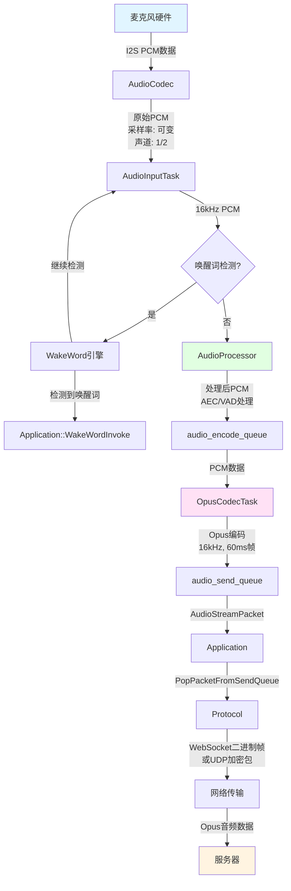

**详细说明：**

1. **硬件采集阶段**
   - 麦克风通过 I2S 接口将模拟信号转换为数字 PCM 数据
   - `AudioCodec` 负责 I2S 配置和数据读取
   - 采样率可能是 16kHz、24kHz、48kHz 等（取决于硬件）

2. **重采样阶段**（如果需要）
   - 如果硬件采样率不是 16kHz，`AudioService` 使用 `input_resampler_` 进行重采样
   - 双声道输入会被分离为麦克风通道和参考通道（用于 AEC）

3. **唤醒词检测阶段**
   - `AudioInputTask` 持续读取音频数据
   - 如果启用唤醒词检测，数据会同时送入 `WakeWord` 引擎
   - 检测到唤醒词后触发 `Application::WakeWordInvoke()`

4. **音频处理阶段**
   - 数据送入 `AudioProcessor` 进行处理：
     - **AEC (回声消除)**：如果启用设备端 AEC，会使用参考通道消除回声
     - **VAD (语音活动检测)**：检测是否有语音输入
     - **降噪**：可选的处理步骤
   - 处理后的数据推入 `audio_encode_queue`

5. **编码阶段**
   - `OpusCodecTask` 从队列取出 PCM 数据
   - 使用 Opus 编码器编码为 Opus 格式
   - 编码参数：16kHz 采样率，单声道，60ms 帧时长
   - 编码后的数据推入 `audio_send_queue`

6. **传输阶段**
   - `Application` 从队列取出 `AudioStreamPacket`
   - 根据协议类型选择传输方式：
     - **WebSocket**：直接作为二进制帧发送
     - **MQTT+UDP**：使用 AES-CTR 加密后通过 UDP 发送
   - 数据包可能包含时间戳（用于服务器端 AEC）

### 1.2 音频输出流（下行：服务器 → 设备）

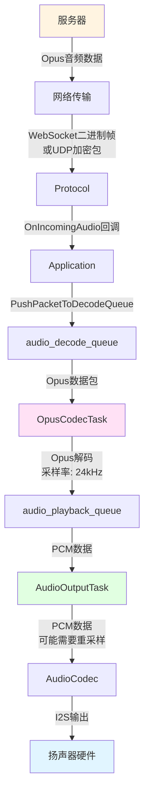

**详细说明：**

1. **接收阶段**
   - `Protocol` 接收来自服务器的音频数据
   - WebSocket：二进制帧直接作为 Opus 数据
   - MQTT+UDP：UDP 数据包需要先解密

2. **解码阶段**
   - `Application` 将接收到的数据包推入 `audio_decode_queue`
   - `OpusCodecTask` 从队列取出 Opus 数据包
   - 使用 Opus 解码器解码为 PCM 数据
   - 服务器端通常使用 24kHz 采样率（更好的音质）

3. **重采样阶段**（如果需要）
   - 如果硬件输出采样率与解码后的采样率不一致，需要进行重采样
   - 例如：24kHz → 48kHz

4. **播放阶段**
   - `AudioOutputTask` 从 `audio_playback_queue` 取出 PCM 数据
   - 通过 `AudioCodec` 的 `OutputData()` 方法输出
   - `AudioCodec` 通过 I2S 接口将数据发送到扬声器

### 1.3 音频处理详细流程

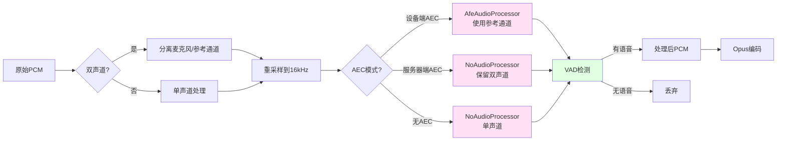

## 2. 控制消息流

### 2.1 设备 → 服务器消息流

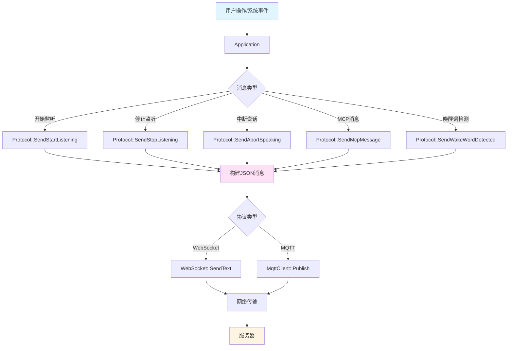

**消息类型示例：**

1. **开始监听**
   ```json
   {
     "session_id": "xxx",
     "type": "listen",
     "state": "start",
     "mode": "auto" | "manual" | "realtime"
   }
   ```

2. **MCP 消息**
   ```json
   {
     "session_id": "xxx",
     "type": "mcp",
     "payload": {
       "jsonrpc": "2.0",
       "id": 1,
       "result": {...}
     }
   }
   ```

### 2.2 服务器 → 设备消息流

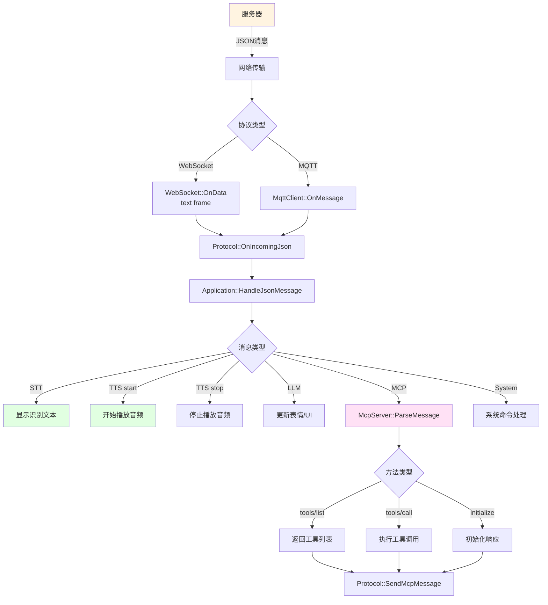

**消息类型示例：**

1. **STT (语音识别)**
   ```json
   {
     "session_id": "xxx",
     "type": "stt",
     "text": "用户说的话"
   }
   ```

2. **TTS (语音合成)**
   ```json
   {
     "session_id": "xxx",
     "type": "tts",
     "state": "start" | "stop" | "sentence_start",
     "text": "要播放的文本"
   }
   ```

3. **MCP 工具调用**
   ```json
   {
     "session_id": "xxx",
     "type": "mcp",
     "payload": {
       "jsonrpc": "2.0",
       "method": "tools/call",
       "params": {
         "name": "self.audio_speaker.set_volume",
         "arguments": {"volume": 50}
       },
       "id": 1
     }
   }
   ```

## 3. MCP 工具调用流程

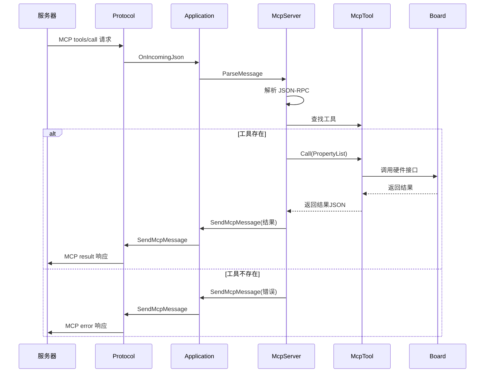

## 4. 设备状态流转数据流

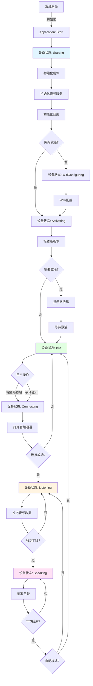

## 5. 网络连接数据流

### 5.1 WebSocket 连接流程

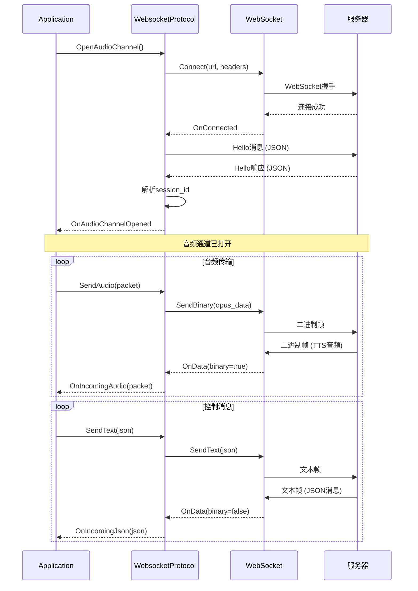

### 5.2 MQTT + UDP 连接流程

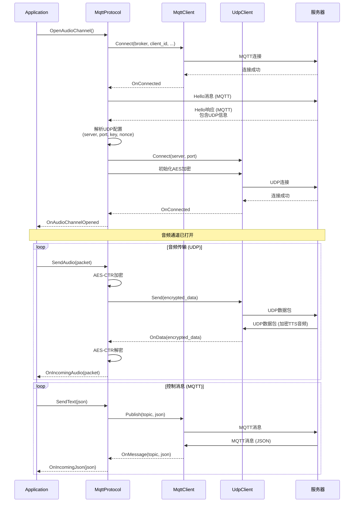

## 6. 唤醒词检测数据流

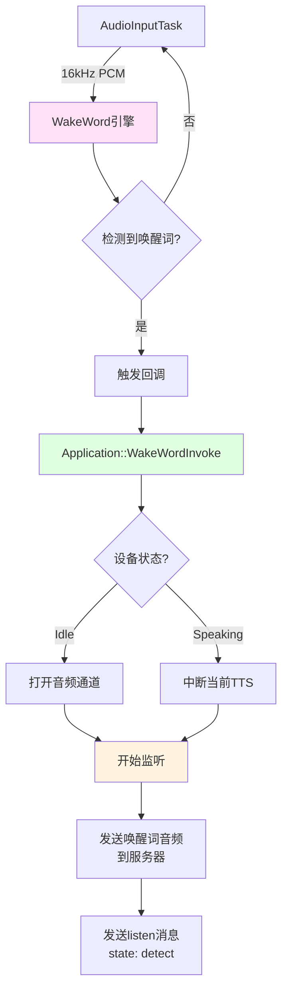

## 7. OTA 升级数据流

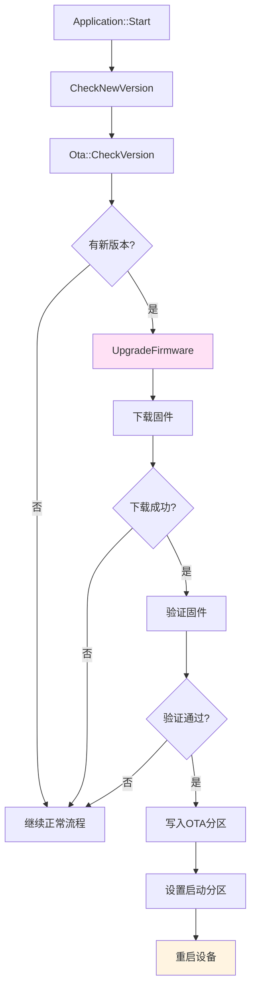

## 8. 资源文件加载数据流

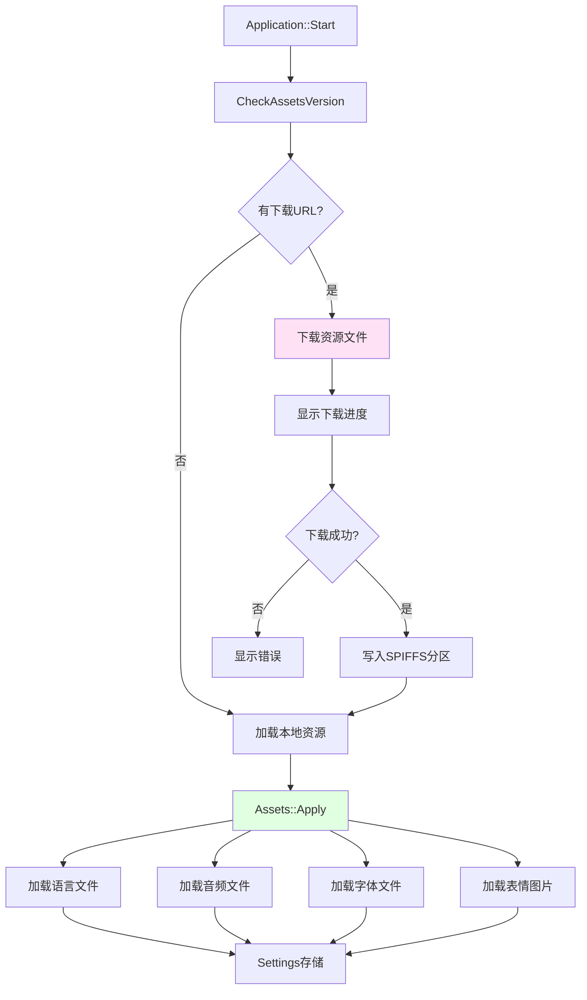

## 9. 数据流总结

### 9.1 关键数据队列

1. **audio_encode_queue**: PCM → Opus 编码队列
2. **audio_send_queue**: 编码后的音频包队列
3. **audio_decode_queue**: 接收到的 Opus 包队列
4. **audio_playback_queue**: 解码后的 PCM 队列

### 9.2 数据格式转换

- **硬件 → 处理**: I2S PCM (可变采样率) → 16kHz PCM
- **处理 → 编码**: 16kHz PCM → Opus (16kHz, 60ms帧)
- **传输**: Opus 二进制数据（可能加密）
- **解码**: Opus → 24kHz PCM
- **播放**: 24kHz PCM → 硬件采样率 PCM → I2S

### 9.3 数据同步机制

- **EventGroup**: 任务间事件通知
- **Mutex**: 保护共享队列
- **Condition Variable**: 队列等待/通知
- **回调函数**: 异步事件处理

### 9.4 性能考虑

- **队列大小限制**: 防止内存溢出
- **及时处理**: 避免队列堆积
- **优先级调度**: 音频任务高优先级
- **缓冲管理**: 平衡延迟和稳定性

