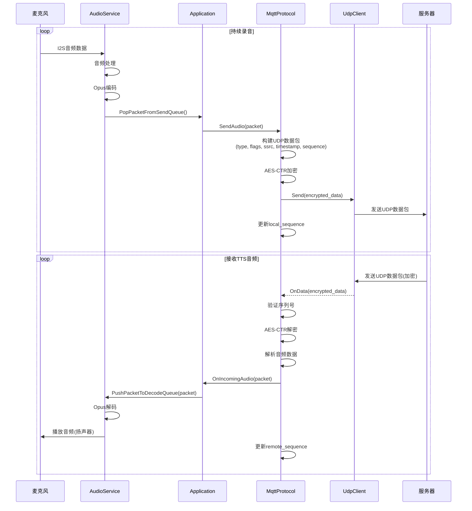

# 模块交互序列图

本文档使用序列图展示小智 ESP32 项目中关键场景下各模块之间的交互流程。

## 1. 系统启动序列

## 2. 唤醒词触发交互序列

## 3. 语音交互完整序列

## 4. MCP 工具调用序列

## 5. WebSocket 连接建立序列

## 6. MQTT + UDP 连接建立序列

## 7. 音频数据传输序列（WebSocket）

## 8. 音频数据传输序列（MQTT + UDP）

## 9. OTA 升级序列

## 10. 资源文件下载序列

## 11. 设备状态变化通知序列

## 12. 错误处理序列

## 13. 电源管理序列

## 14. 双网络切换序列

## 15. 序列图总结

### 15.1 关键交互模式

1. **请求-响应模式**: MCP工具调用、协议消息交换
2. **事件驱动模式**: 状态变化通知、音频事件处理
3. **流式传输模式**: 音频数据传输、OTA升级
4. **回调模式**: 异步事件处理、网络状态变化

### 15.2 同步机制

- **阻塞调用**: 关键操作等待完成
- **异步回调**: 网络操作、音频处理
- **事件通知**: 状态变化、错误处理
- **队列缓冲**: 音频数据传输

### 15.3 错误处理

- **重试机制**: 网络连接、OTA下载
- **状态恢复**: 连接断开后自动恢复
- **错误通知**: 通过回调函数通知上层
- **日志记录**: 记录关键操作和错误

### 15.4 性能优化

- **异步处理**: 避免阻塞主线程
- **批量操作**: 音频数据批量处理
- **缓存机制**: 资源文件缓存
- **延迟加载**: 按需初始化模块

这些序列图展示了系统各模块之间的详细交互过程，有助于理解系统的运行机制和调试问题。

