# 状态机流程图

本文档详细描述小智 ESP32 项目中各种状态机的状态转换和触发条件。

## 1. 设备主状态机

### 1.1 完整状态转换图

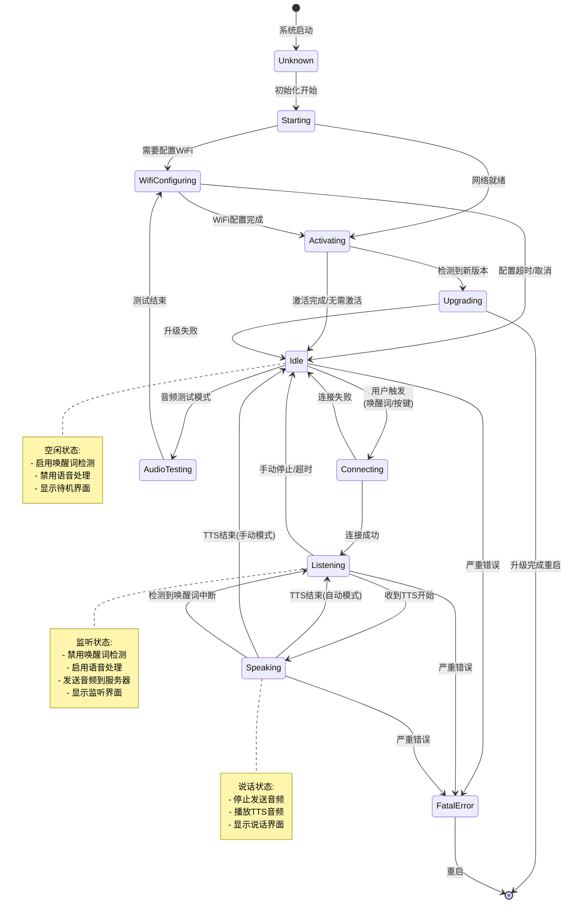

### 1.2 状态详细说明

#### Unknown (未知状态)
- **进入条件**: 系统启动
- **功能**: 初始状态，等待初始化
- **退出条件**: 开始初始化流程

#### Starting (启动中)
- **进入条件**: 开始初始化
- **功能**: 
  - 初始化硬件
  - 初始化音频服务
  - 初始化显示
  - 初始化网络
- **退出条件**: 
  - 需要配置 WiFi → `WifiConfiguring`
  - 网络就绪 → `Activating`

#### WifiConfiguring (WiFi配置中)
- **进入条件**: 需要配置 WiFi
- **功能**:
  - 进入 WiFi AP 模式
  - 提供配置界面
  - 等待用户配置
- **退出条件**:
  - 配置完成 → `Activating`
  - 超时/取消 → `Idle`

#### Activating (激活中)
- **进入条件**: 网络就绪
- **功能**:
  - 检查新版本
  - 显示激活码（如需要）
  - 等待激活确认
- **退出条件**:
  - 检测到新版本 → `Upgrading`
  - 激活完成/无需激活 → `Idle`

#### Upgrading (升级中)
- **进入条件**: 检测到新版本
- **功能**:
  - 下载固件
  - 验证固件
  - 写入 OTA 分区
  - 重启设备
- **退出条件**:
  - 升级成功 → 重启（回到 `Unknown`）
  - 升级失败 → `Idle`

#### Idle (空闲)
- **进入条件**: 
  - 激活完成
  - 连接失败
  - 会话结束
- **功能**:
  - 启用唤醒词检测
  - 禁用语音处理
  - 显示待机界面
  - 等待用户操作
- **退出条件**:
  - 用户触发 → `Connecting`
  - 音频测试 → `AudioTesting`

#### Connecting (连接中)
- **进入条件**: 用户触发（唤醒词/按键）
- **功能**:
  - 打开音频通道
  - 建立网络连接
  - 发送 Hello 消息
- **退出条件**:
  - 连接成功 → `Listening`
  - 连接失败 → `Idle`

#### Listening (监听中)
- **进入条件**: 音频通道打开成功
- **功能**:
  - 禁用唤醒词检测
  - 启用语音处理
  - 发送音频数据到服务器
  - 发送 listen 消息
  - 显示监听界面
- **退出条件**:
  - 收到 TTS 开始 → `Speaking`
  - 手动停止 → `Idle`
  - 超时 → `Idle`

#### Speaking (说话中)
- **进入条件**: 收到 TTS 开始消息
- **功能**:
  - 停止发送音频
  - 播放 TTS 音频
  - 显示说话界面
- **退出条件**:
  - TTS 结束（自动模式）→ `Listening`
  - TTS 结束（手动模式）→ `Idle`
  - 检测到唤醒词中断 → `Listening`

#### AudioTesting (音频测试)
- **进入条件**: 进入音频测试模式
- **功能**:
  - 测试音频输入/输出
  - 显示测试界面
- **退出条件**: 测试结束 → `WifiConfiguring`

#### FatalError (致命错误)
- **进入条件**: 发生严重错误
- **功能**:
  - 显示错误信息
  - 记录错误日志
- **退出条件**: 重启设备

## 2. 协议连接状态机

### 2.1 WebSocket 协议状态机

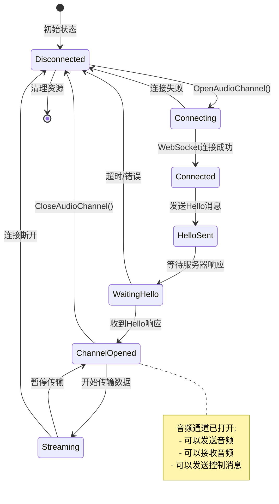

### 2.2 MQTT + UDP 协议状态机

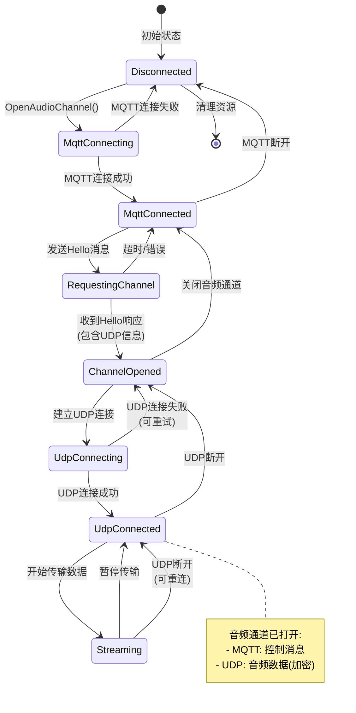

## 3. 音频服务状态机

### 3.1 音频处理状态

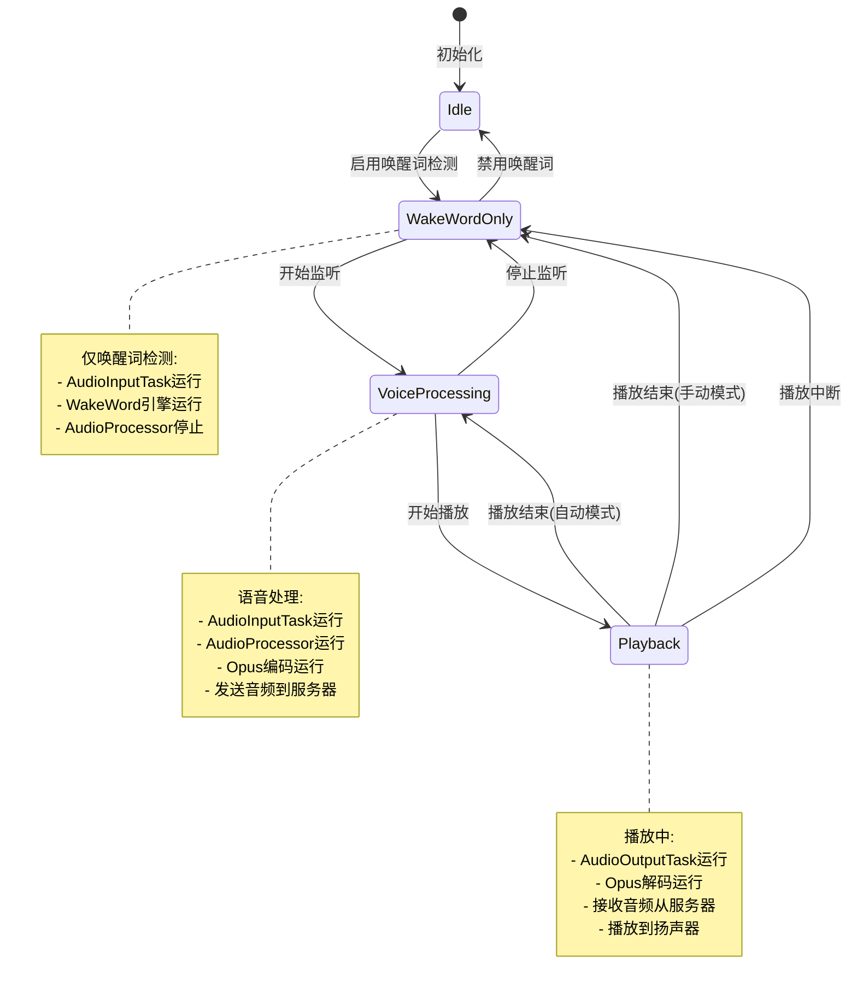

### 3.2 音频通道状态

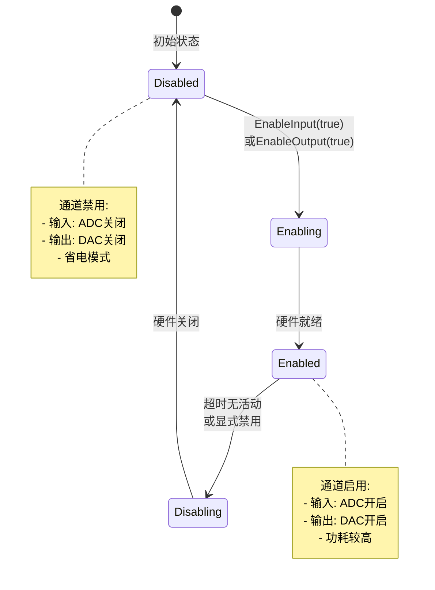

## 4. 网络连接状态机

### 4.1 WiFi 连接状态

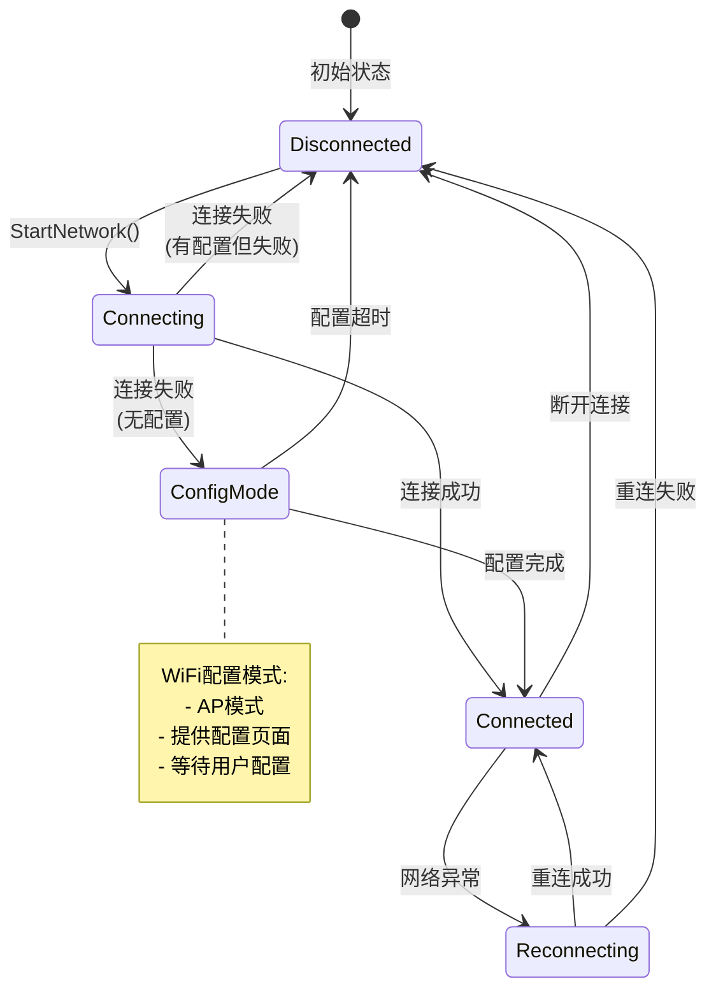

### 4.2 ML307 4G 连接状态

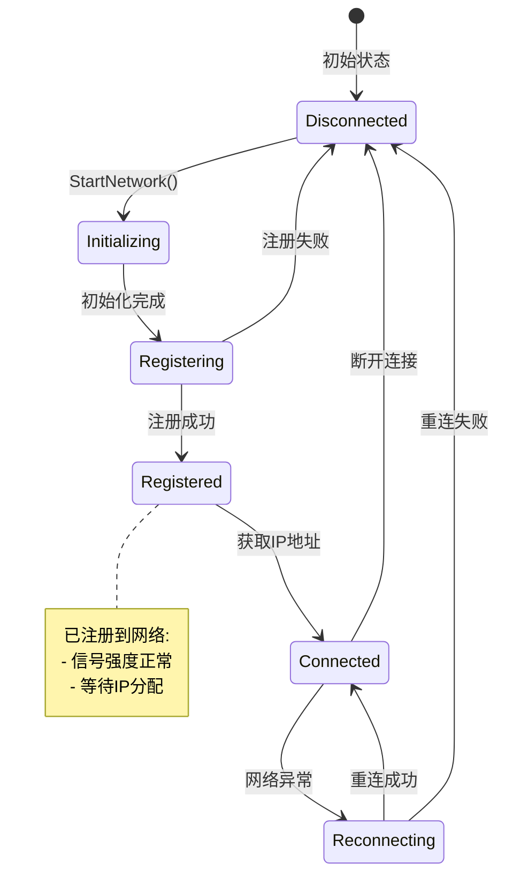

## 5. MCP 会话状态机

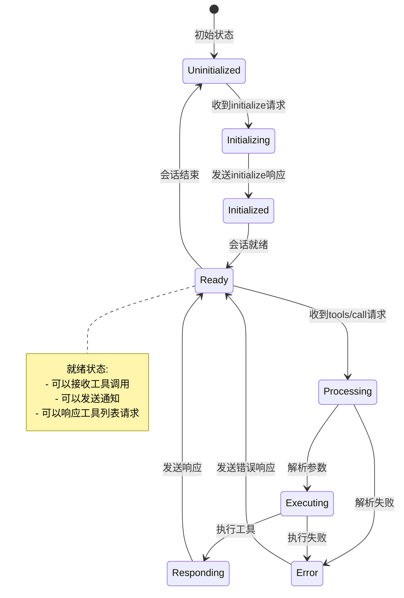

## 6. 唤醒词检测状态机

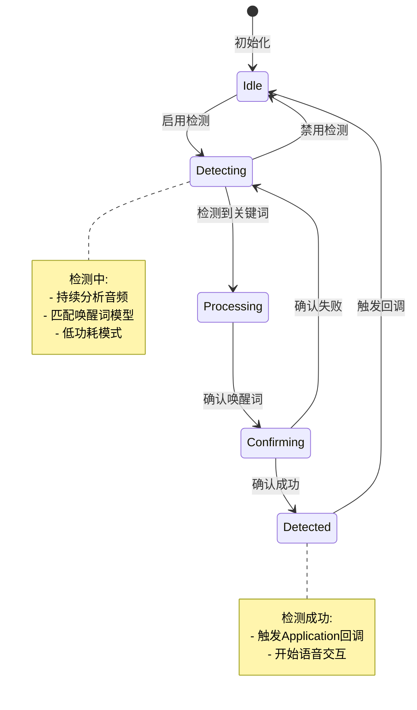

## 7. OTA 升级状态机

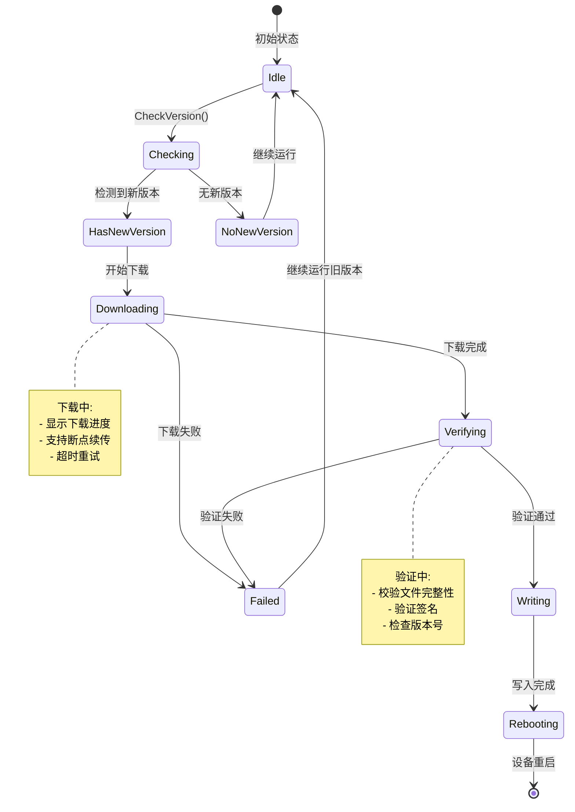

## 8. 电源管理状态机

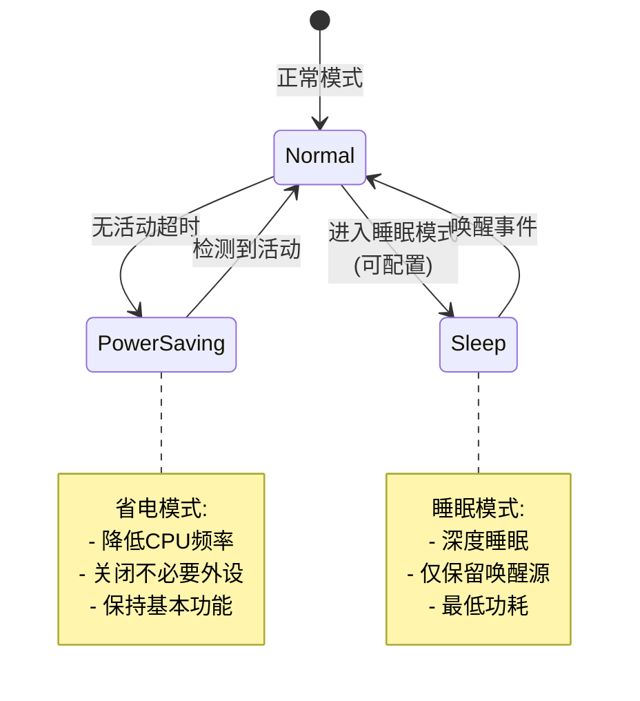

## 9. 状态转换表

### 9.1 设备主状态转换表

| 当前状态 | 事件 | 下一状态 | 动作 |
|---------|------|---------|------|
| Unknown | 初始化开始 | Starting | 初始化硬件 |
| Starting | 需要WiFi配置 | WifiConfiguring | 进入AP模式 |
| Starting | 网络就绪 | Activating | 检查版本 |
| WifiConfiguring | 配置完成 | Activating | 连接WiFi |
| Activating | 检测到新版本 | Upgrading | 下载固件 |
| Activating | 激活完成 | Idle | 初始化协议 |
| Idle | 用户触发 | Connecting | 打开音频通道 |
| Connecting | 连接成功 | Listening | 开始监听 |
| Listening | 收到TTS | Speaking | 停止发送音频 |
| Speaking | TTS结束(自动) | Listening | 继续监听 |
| Speaking | TTS结束(手动) | Idle | 停止会话 |

### 9.2 协议状态转换表

| 当前状态 | 事件 | 下一状态 | 动作 |
|---------|------|---------|------|
| Disconnected | OpenAudioChannel() | Connecting | 建立连接 |
| Connecting | 连接成功 | Connected | 发送Hello |
| Connected | 收到Hello响应 | ChannelOpened | 标记就绪 |
| ChannelOpened | 开始传输 | Streaming | 发送/接收数据 |
| Streaming | 连接断开 | Disconnected | 清理资源 |

## 10. 状态同步机制

### 10.1 状态通知

- **DeviceStateEventManager**: 管理状态变化事件
- **回调函数**: 各模块注册状态变化回调
- **EventGroup**: 任务间状态同步

### 10.2 状态持久化

- **NVS存储**: 保存关键状态（如WiFi配置）
- **运行时状态**: 仅在内存中，重启后重置

### 10.3 状态恢复

- **网络断开**: 自动重连，恢复连接状态
- **音频通道异常**: 自动关闭，回到Idle状态
- **严重错误**: 记录日志，重启设备

## 11. 状态机设计原则

### 11.1 状态定义

- **明确性**: 每个状态有明确的含义和功能
- **互斥性**: 同一时刻只能处于一个状态
- **完整性**: 覆盖所有可能的状态

### 11.2 转换规则

- **确定性**: 相同条件下总是转换到相同状态
- **可追溯**: 状态转换有明确的触发条件
- **可恢复**: 异常情况下能恢复到安全状态

### 11.3 状态保护

- **状态检查**: 转换前检查当前状态
- **并发控制**: 使用互斥锁保护状态变量
- **原子操作**: 状态转换是原子性的

## 12. 总结

状态机设计确保了系统行为的可预测性和稳定性：

1. **清晰的状态定义**: 每个状态都有明确的职责
2. **完整的转换路径**: 覆盖所有可能的转换场景
3. **异常处理**: 异常情况下能安全恢复
4. **状态同步**: 多模块间状态保持一致
5. **可扩展性**: 易于添加新状态和转换

这种设计使得系统在各种情况下都能保持稳定运行。

