# 软件架构 UML 类图

本文档使用 Mermaid 语法绘制 UML 类图，展示小智 ESP32 项目的核心类结构和关系。

## 1. 核心类图总览


## 2. 音频处理类图


## 3. 硬件抽象层类图

```mermaid
classDiagram
    class Board {
        <<abstract>>
        #uuid_ string
        +GetInstance() Board&
        +GetBoardType() string
        +GetAudioCodec() AudioCodec*
        +GetDisplay() Display*
        +GetLed() Led*
        +GetNetwork() NetworkInterface*
        +StartNetwork()
    }

    class WifiBoard {
        -wifi_config_mode_ bool
        +GetBoardType() string
        +StartNetwork()
        +GetNetwork() NetworkInterface*
        +EnterWifiConfigMode()
    }

    class Ml307Board {
        -ml307_ ML307*
        +GetBoardType() string
        +StartNetwork()
        +GetNetwork() NetworkInterface*
    }

    class DualNetworkBoard {
        -current_board_ Board*
        -network_type_ NetworkType
        +SwitchNetworkType()
        +GetCurrentBoard() Board&
    }

    class AudioCodec {
        <<abstract>>
        +Start()
        +InputData(vector~int16_t~) bool
        +OutputData(vector~int16_t~)
        +input_sample_rate() int
        +output_sample_rate() int
    }

    class Es8311AudioCodec {
        -i2s_config_ i2s_config_t
        +Start()
        +InputData(vector~int16_t~) bool
        +OutputData(vector~int16_t~)
    }

    class BoxAudioCodec {
        -i2s_config_ i2s_config_t
        +Start()
        +InputData(vector~int16_t~) bool
        +OutputData(vector~int16_t~)
    }

    class Display {
        <<abstract>>
        +SetStatus(string)
        +SetEmotion(string)
        +SetChatMessage(string, string)
    }

    class OledDisplay {
        -ssd1306_ handle
        +SetStatus(string)
        +SetEmotion(string)
    }

    class LcdDisplay {
        -lcd_ handle
        +SetStatus(string)
        +SetEmotion(string)
    }

    class LvglDisplay {
        -display_ lv_display_t*
        +SetStatus(string)
        +SetEmotion(string)
        +SetChatMessage(string, string)
    }

    class Led {
        <<abstract>>
        +OnStateChanged()
        +SetColor(int, int, int)
    }

    class SingleLed {
        -gpio_ gpio_num_t
        +OnStateChanged()
    }

    class CircularStrip {
        -led_strip_ handle
        +OnStateChanged()
        +SetColor(int, int, int)
    }

    Board <|-- WifiBoard
    Board <|-- Ml307Board
    Board <|-- DualNetworkBoard
    
    AudioCodec <|-- Es8311AudioCodec
    AudioCodec <|-- BoxAudioCodec
    
    Display <|-- OledDisplay
    Display <|-- LcdDisplay
    Display <|-- LvglDisplay
    
    Led <|-- SingleLed
    Led <|-- CircularStrip
```



## 4. MCP 协议类图

```mermaid
classDiagram
    class McpServer {
        -tools_ vector~McpTool*~
        +GetInstance() McpServer&
        +AddTool(McpTool*)
        +AddTool(string, string, PropertyList, function)
        +AddUserOnlyTool(string, string, PropertyList, function)
        +ParseMessage(cJSON*)
        -GetToolsList(int, string, bool)
        -DoToolCall(int, string, cJSON*)
        -ReplyResult(int, string)
        -ReplyError(int, string)
    }

    class McpTool {
        -name_ string
        -description_ string
        -properties_ PropertyList
        -callback_ function
        -user_only_ bool
        +Call(PropertyList) string
        +to_json() string
        +name() string
        +description() string
        +properties() PropertyList
    }

    class Property {
        -name_ string
        -type_ PropertyType
        -value_ variant
        -has_default_value_ bool
        -min_value_ optional~int~
        -max_value_ optional~int~
        +name() string
        +type() PropertyType
        +value() T
        +set_value(T)
        +to_json() string
    }

    class PropertyList {
        -properties_ vector~Property~
        +AddProperty(Property)
        +GetRequired() vector~string~
        +to_json() string
        +operator[](string) Property
    }

    enum PropertyType {
        kPropertyTypeBoolean
        kPropertyTypeInteger
        kPropertyTypeString
    }

    class ImageContent {
        -encoded_data_ string
        -mime_type_ string
        +to_json() string
    }

    McpServer --> McpTool : manages
    McpTool --> PropertyList : contains
    PropertyList --> Property : contains
    Property --> PropertyType : uses
    McpTool --> ImageContent : may return
```

## 5. 协议层类图

```mermaid
classDiagram
    class Protocol {
        <<abstract>>
        #server_sample_rate_ int
        #server_frame_duration_ int
        #session_id_ string
        #error_occurred_ bool
        #last_incoming_time_ time_point
        +OpenAudioChannel() bool*
        +CloseAudioChannel()*
        +IsAudioChannelOpened() bool*
        +SendAudio(AudioStreamPacket*) bool*
        +SendStartListening(ListeningMode)
        +SendStopListening()
        +SendAbortSpeaking(AbortReason)
        +SendMcpMessage(string)
        #SendText(string) bool*
        #IsTimeout() bool
        #SetError(string)
    }

    class WebsocketProtocol {
        -websocket_ WebSocket*
        -binary_version_ int
        +OpenAudioChannel() bool
        +CloseAudioChannel()
        +IsAudioChannelOpened() bool
        +SendAudio(AudioStreamPacket*) bool
        +SendText(string) bool
        -OnData(uint8_t*, size_t, bool)
        -OnDisconnected()
        -OnConnected()
    }

    class MqttProtocol {
        -mqtt_ MqttClient*
        -udp_ UdpClient*
        -local_sequence_ uint32_t
        -remote_sequence_ uint32_t
        -aes_context_ mbedtls_aes_context
        +OpenAudioChannel() bool
        +CloseAudioChannel()
        +IsAudioChannelOpened() bool
        +SendAudio(AudioStreamPacket*) bool
        +SendText(string) bool
        -OnMqttMessage(string, string)
        -OnMqttConnected()
        -OnMqttDisconnected()
        -OnUdpData(uint8_t*, size_t)
    }

    class AudioStreamPacket {
        +sample_rate int
        +frame_duration int
        +timestamp uint32_t
        +payload vector~uint8_t~
    }

    enum ListeningMode {
        kListeningModeAutoStop
        kListeningModeManualStop
        kListeningModeRealtime
    }

    enum AbortReason {
        kAbortReasonNone
        kAbortReasonWakeWordDetected
    }

    Protocol <|-- WebsocketProtocol
    Protocol <|-- MqttProtocol
    Protocol --> AudioStreamPacket : uses
    Protocol --> ListeningMode : uses
    Protocol --> AbortReason : uses
```

## 6. 设备状态管理类图

```mermaid
classDiagram
    class Application {
        -device_state_ DeviceState
        +SetDeviceState(DeviceState)
        +GetDeviceState() DeviceState
    }

    enum DeviceState {
        kDeviceStateUnknown
        kDeviceStateStarting
        kDeviceStateWifiConfiguring
        kDeviceStateIdle
        kDeviceStateConnecting
        kDeviceStateListening
        kDeviceStateSpeaking
        kDeviceStateUpgrading
        kDeviceStateActivating
        kDeviceStateAudioTesting
        kDeviceStateFatalError
    }

    class DeviceStateEventManager {
        +GetInstance() DeviceStateEventManager&
        +PostStateChangeEvent(DeviceState, DeviceState)
        +RegisterListener(function)
    }

    class DeviceStateEvent {
        +previous_state DeviceState
        +current_state DeviceState
        +timestamp time_point
    }

    Application --> DeviceState : uses
    DeviceStateEventManager --> DeviceStateEvent : creates
    DeviceStateEvent --> DeviceState : contains
```

## 7. 网络接口类图


## 8. 工具和资源管理类图


## 9. 类关系说明

### 9.1 继承关系

- **Protocol** 是抽象基类，`WebsocketProtocol` 和 `MqttProtocol` 继承并实现其接口
- **Board** 是抽象基类，各种具体板卡类（如 `WifiBoard`, `Ml307Board`）继承它
- **AudioCodec**, **Display**, **Led** 等都有对应的抽象基类和具体实现

### 9.2 组合关系

- **Application** 组合了 `Protocol`, `AudioService`, `Board`, `McpServer`
- **AudioService** 组合了 `AudioCodec`, `AudioProcessor`, `WakeWord`, `OpusEncoderWrapper`, `OpusDecoderWrapper`
- **McpServer** 管理多个 `McpTool` 实例

### 9.3 依赖关系

- **Application** 依赖 `Protocol` 进行网络通信
- **AudioService** 依赖 `AudioCodec` 进行音频 I/O
- **Protocol** 依赖 `NetworkInterface` 进行网络连接

### 9.4 单例模式

多个类使用单例模式：
- `Application::GetInstance()`
- `Board::GetInstance()`
- `McpServer::GetInstance()`
- `Assets::GetInstance()`
- `DeviceStateEventManager::GetInstance()`

## 10. 设计模式应用

### 10.1 工厂模式

`Board` 类通过 `create_board()` 函数创建具体实例，使用 `DECLARE_BOARD` 宏声明。

### 10.2 策略模式

- `Protocol` 基类定义策略接口，`WebsocketProtocol` 和 `MqttProtocol` 实现不同策略
- `AudioProcessor` 支持不同的处理策略

### 10.3 观察者模式

通过回调函数实现：
- `Protocol` 的各种回调函数
- `AudioProcessor` 的输出回调
- `WakeWord` 的检测回调

### 10.4 适配器模式

`AudioCodec` 适配不同的硬件音频芯片，提供统一接口。

## 11. 总结

通过 UML 类图可以清晰地看到：

1. **分层清晰**：应用层、服务层、协议层、硬件抽象层职责分明
2. **接口统一**：通过抽象基类定义统一接口，便于扩展
3. **模块化设计**：各模块相对独立，通过接口交互
4. **可扩展性强**：通过继承和组合可以轻松添加新功能
5. **设计模式应用**：合理使用设计模式提高代码质量

这种架构设计使得项目具有良好的可维护性和可扩展性。

