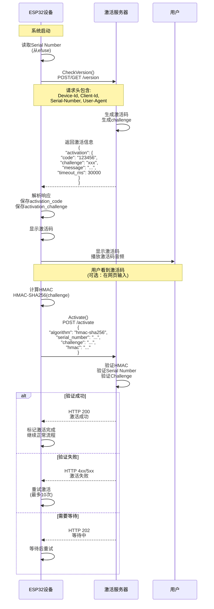
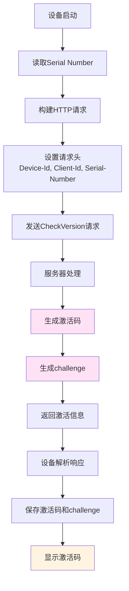
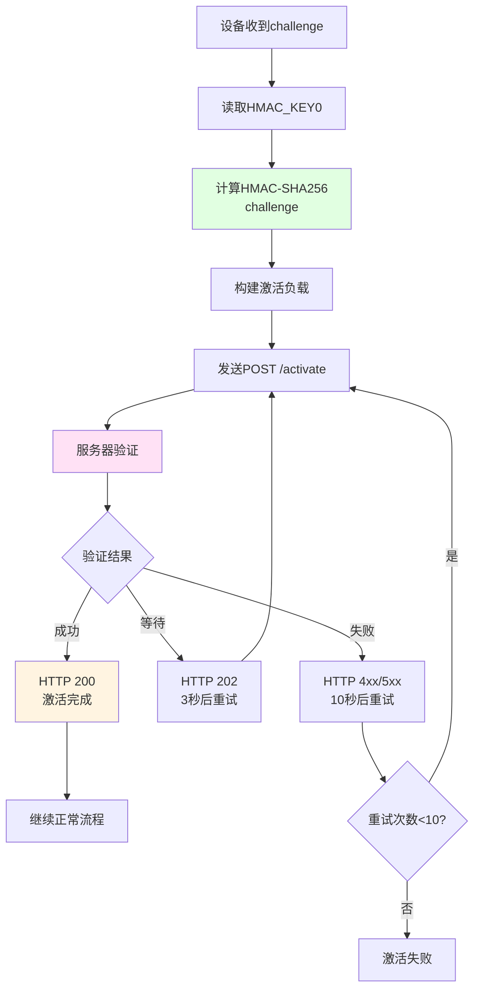

# 设备激活流程详解

本文档详细说明设备激活的完整流程，包括激活码生成、激活过程和数据流。

## 1. 激活流程概述

设备激活是一个安全机制，用于验证设备的合法性并获取服务配置。激活流程包括两个阶段：

1. **获取激活信息**：设备向服务器请求激活码和挑战值
2. **完成激活**：设备使用硬件密钥计算 HMAC，向服务器证明身份

## 2. 激活码来源

**激活码是由服务器生成的，不是设备端生成的。**

激活码在 `CheckVersion()` 请求的响应中返回，服务器根据设备信息（Device-Id、Client-Id、Serial-Number）生成唯一的激活码。

## 3. 完整激活流程

### 3.1 流程图



### 3.2 详细步骤

#### 步骤 1: 系统启动和初始化

```cpp
// main/ota.cc - Ota::Ota()
Ota::Ota() {
#ifdef ESP_EFUSE_BLOCK_USR_DATA
    // 从 efuse 读取 Serial Number
    uint8_t serial_number[33] = {0};
    if (esp_efuse_read_field_blob(ESP_EFUSE_USER_DATA, serial_number, 32 * 8) == ESP_OK) {
        if (serial_number[0] != 0) {
            serial_number_ = std::string(reinterpret_cast<char*>(serial_number), 32);
            has_serial_number_ = true;
        }
    }
#endif
}
```

**关键点：**
- Serial Number 存储在 ESP32 的 efuse 中
- 这是设备的唯一硬件标识
- 如果 efuse 中没有 Serial Number，则使用激活版本 1（无 HMAC 验证）

#### 步骤 2: 检查版本并获取激活信息

```cpp
// main/ota.cc - Ota::CheckVersion()
esp_err_t Ota::CheckVersion() {
    // 1. 设置 HTTP 请求头
    auto http = SetupHttp();
    // 设置请求头：
    // - Activation-Version: "1" 或 "2"（取决于是否有 Serial Number）
    // - Device-Id: MAC 地址
    // - Client-Id: UUID
    // - Serial-Number: efuse 中的序列号（如果有）
    
    // 2. 发送请求
    std::string data = board.GetSystemInfoJson();
    std::string method = data.length() > 0 ? "POST" : "GET";
    http->SetContent(std::move(data));
    http->Open(method, url);
    
    // 3. 解析响应
    cJSON *activation = cJSON_GetObjectItem(root, "activation");
    if (cJSON_IsObject(activation)) {
        // 提取激活码
        activation_code_ = cJSON_GetObjectItem(activation, "code")->valuestring;
        // 提取挑战值
        activation_challenge_ = cJSON_GetObjectItem(activation, "challenge")->valuestring;
        // 提取提示消息
        activation_message_ = cJSON_GetObjectItem(activation, "message")->valuestring;
        // 提取超时时间
        activation_timeout_ms_ = cJSON_GetObjectItem(activation, "timeout_ms")->valueint;
    }
}
```

**服务器响应示例：**

```json
{
  "activation": {
    "code": "123456",
    "challenge": "a1b2c3d4e5f6...",
    "message": "请在网页输入激活码完成激活",
    "timeout_ms": 30000
  },
  "firmware": {
    "version": "2.0.0",
    "url": "https://..."
  },
  "mqtt": { ... },
  "websocket": { ... }
}
```

#### 步骤 3: 显示激活码

```cpp
// main/application.cc - Application::ShowActivationCode()
void Application::ShowActivationCode(const std::string& code, const std::string& message) {
    // 1. 显示提示信息
    Alert(Lang::Strings::ACTIVATION, message.c_str(), "link", Lang::Sounds::OGG_ACTIVATION);
    
    // 2. 逐位播放激活码音频
    for (const auto& digit : code) {
        // 播放对应数字的音频文件（0.ogg, 1.ogg, ...）
        audio_service_.PlaySound(digit_sound);
    }
}
```

**用户体验：**
- 屏幕上显示激活码（如 "123456"）
- 设备播放激活码的音频（逐位播放）
- 显示提示消息（如 "请在网页输入激活码完成激活"）

#### 步骤 4: 计算激活负载（HMAC）

```cpp
// main/ota.cc - Ota::GetActivationPayload()
std::string Ota::GetActivationPayload() {
    if (!has_serial_number_) {
        return "{}";  // 无 Serial Number，返回空负载
    }

    // 1. 使用 HMAC-SHA256 计算挑战值的 HMAC
    uint8_t hmac_result[32];
    esp_err_t ret = esp_hmac_calculate(
        HMAC_KEY0,                           // 使用 Key0（efuse 中的密钥）
        (uint8_t*)activation_challenge_.data(),  // 挑战值
        activation_challenge_.size(),        // 挑战值长度
        hmac_result                          // 输出 HMAC 结果
    );
    
    // 2. 将 HMAC 转换为十六进制字符串
    std::string hmac_hex;
    for (size_t i = 0; i < sizeof(hmac_result); i++) {
        char buffer[3];
        sprintf(buffer, "%02x", hmac_result[i]);
        hmac_hex += buffer;
    }
    
    // 3. 构建 JSON 负载
    cJSON *payload = cJSON_CreateObject();
    cJSON_AddStringToObject(payload, "algorithm", "hmac-sha256");
    cJSON_AddStringToObject(payload, "serial_number", serial_number_.c_str());
    cJSON_AddStringToObject(payload, "challenge", activation_challenge_.c_str());
    cJSON_AddStringToObject(payload, "hmac", hmac_hex.c_str());
    
    return json_string;
}
```

**HMAC 计算说明：**
- **密钥**：使用 ESP32 efuse 中的 `HMAC_KEY0`
- **消息**：服务器返回的 `challenge` 值
- **算法**：HMAC-SHA256
- **输出**：64 字符的十六进制字符串

#### 步骤 5: 发送激活请求

```cpp
// main/ota.cc - Ota::Activate()
esp_err_t Ota::Activate() {
    // 1. 构建激活 URL
    std::string url = GetCheckVersionUrl();
    url += "/activate";
    
    // 2. 设置 HTTP 请求
    auto http = SetupHttp();
    std::string data = GetActivationPayload();
    http->SetContent(std::move(data));
    
    // 3. 发送 POST 请求
    http->Open("POST", url);
    
    // 4. 处理响应
    auto status_code = http->GetStatusCode();
    if (status_code == 200) {
        ESP_LOGI(TAG, "Activation successful");
        return ESP_OK;
    } else if (status_code == 202) {
        // 服务器需要更多时间处理
        return ESP_ERR_TIMEOUT;
    } else {
        // 激活失败
        return ESP_FAIL;
    }
}
```

**激活请求负载示例：**

```json
{
  "algorithm": "hmac-sha256",
  "serial_number": "ABC123...",
  "challenge": "a1b2c3d4e5f6...",
  "hmac": "1a2b3c4d5e6f..."
}
```

#### 步骤 6: 服务器验证

服务器端需要：

1. **验证 Serial Number**
   - 检查 Serial Number 是否在数据库中
   - 检查设备是否已被激活

2. **验证 Challenge**
   - 检查 challenge 是否有效
   - 检查 challenge 是否过期（根据 timeout_ms）

3. **验证 HMAC**
   - 使用相同的密钥（与设备 efuse 中的 Key0 对应）
   - 计算 challenge 的 HMAC-SHA256
   - 与设备发送的 HMAC 比较

4. **返回结果**
   - **200 OK**：激活成功
   - **202 Accepted**：需要等待（异步处理）
   - **4xx/5xx**：激活失败

#### 步骤 7: 重试机制

```cpp
// main/application.cc - Application::CheckNewVersion()
for (int i = 0; i < 10; ++i) {
    ESP_LOGI(TAG, "Activating... %d/%d", i + 1, 10);
    esp_err_t err = ota.Activate();
    if (err == ESP_OK) {
        // 激活成功
        break;
    } else if (err == ESP_ERR_TIMEOUT) {
        // 需要等待，3秒后重试
        vTaskDelay(pdMS_TO_TICKS(3000));
    } else {
        // 激活失败，10秒后重试
        vTaskDelay(pdMS_TO_TICKS(10000));
    }
}
```

**重试策略：**
- 最多重试 10 次
- HTTP 202（等待中）：3 秒后重试
- 其他错误：10 秒后重试
- 如果设备状态变为 Idle，停止重试

## 4. 数据流图

### 4.1 获取激活信息流程



### 4.2 完成激活流程



## 5. 安全机制

### 5.1 硬件密钥（HMAC_KEY0）

- **存储位置**：ESP32 efuse 中的 `HMAC_KEY0`
- **特点**：
  - 硬件保护，无法从外部读取
  - 每个设备唯一
  - 不可修改（一次性写入）

### 5.2 Challenge-Response 机制

1. **服务器生成 challenge**
   - 随机字符串
   - 有时效性（timeout_ms）

2. **设备计算 HMAC**
   - 使用硬件密钥
   - 证明设备拥有正确的密钥

3. **服务器验证**
   - 使用相同的密钥验证
   - 确保设备身份合法

### 5.3 激活码的作用

激活码主要用于：
- **用户界面显示**：让用户知道设备需要激活
- **网页输入**：用户可以在网页输入激活码完成激活（可选）
- **音频播放**：方便用户获取激活码

**注意**：激活码本身不用于安全验证，真正的验证是通过 HMAC 完成的。

## 6. 激活版本

### 6.1 版本 1（无 Serial Number）

```cpp
// 设备没有 Serial Number
has_serial_number_ = false;
http->SetHeader("Activation-Version", "1");
```

**特点：**
- 不使用 HMAC 验证
- 激活负载为空 `{}`
- 依赖 Device-Id 和 Client-Id 验证

### 6.2 版本 2（有 Serial Number）

```cpp
// 设备有 Serial Number
has_serial_number_ = true;
http->SetHeader("Activation-Version", "2");
http->SetHeader("Serial-Number", serial_number_.c_str());
```

**特点：**
- 使用 HMAC-SHA256 验证
- 激活负载包含 Serial Number、Challenge、HMAC
- 更安全的验证机制

## 7. 服务器端实现要点

### 7.1 CheckVersion 端点

**请求：**
```
POST /version
Headers:
  Device-Id: <MAC地址>
  Client-Id: <UUID>
  Serial-Number: <序列号> (可选)
  Activation-Version: "1" 或 "2"
  User-Agent: <设备信息>
```

**响应：**
```json
{
  "activation": {
    "code": "123456",           // 激活码（用于显示）
    "challenge": "random...",   // 挑战值（用于HMAC）
    "message": "提示信息",      // 用户提示
    "timeout_ms": 30000         // 超时时间（毫秒）
  },
  "firmware": { ... },
  "mqtt": { ... },
  "websocket": { ... }
}
```

### 7.2 Activate 端点

**请求：**
```
POST /activate
Headers:
  Device-Id: <MAC地址>
  Client-Id: <UUID>
  Serial-Number: <序列号>
  Activation-Version: "2"
Body:
{
  "algorithm": "hmac-sha256",
  "serial_number": "...",
  "challenge": "...",
  "hmac": "..."
}
```

**响应：**
- **200 OK**：激活成功
- **202 Accepted**：需要等待（异步处理）
- **400 Bad Request**：请求格式错误
- **401 Unauthorized**：HMAC 验证失败
- **403 Forbidden**：设备已被激活或不允许激活
- **404 Not Found**：Serial Number 不存在
- **408 Request Timeout**：Challenge 已过期
- **500 Internal Server Error**：服务器错误

## 8. 错误处理

### 8.1 常见错误

1. **无 Serial Number**
   - 使用激活版本 1
   - 激活负载为空

2. **HMAC 计算失败**
   - 检查 efuse 中是否有 HMAC_KEY0
   - 检查 challenge 是否有效

3. **激活超时**
   - HTTP 202：等待后重试
   - Challenge 过期：重新获取激活信息

4. **激活失败**
   - 检查 Serial Number 是否正确
   - 检查服务器密钥是否匹配
   - 检查设备是否已被激活

### 8.2 重试策略

```cpp
// 最多重试 10 次
for (int i = 0; i < 10; ++i) {
    esp_err_t err = ota.Activate();
    if (err == ESP_OK) {
        break;  // 成功
    } else if (err == ESP_ERR_TIMEOUT) {
        vTaskDelay(pdMS_TO_TICKS(3000));  // 等待 3 秒
    } else {
        vTaskDelay(pdMS_TO_TICKS(10000)); // 等待 10 秒
    }
}
```

## 9. 配置和调试

### 9.1 查看激活信息

```cpp
// 检查是否有激活码
if (ota.HasActivationCode()) {
    ESP_LOGI(TAG, "Activation code: %s", ota.GetActivationCode().c_str());
}

// 检查是否有挑战值
if (ota.HasActivationChallenge()) {
    ESP_LOGI(TAG, "Activation challenge: %s", ota.GetActivationChallenge().c_str());
}
```

### 9.2 调试日志

激活过程中的关键日志：

```
[Ota] Setup HTTP, User-Agent: ..., Serial-Number: ...
[Ota] Current version: 2.0.0
[Ota] Activation payload: {"algorithm":"hmac-sha256",...}
[Application] Activating... 1/10
[Ota] Activation successful
```

## 10. 总结

### 10.1 激活流程要点

1. **激活码由服务器生成**，在 CheckVersion 响应中返回
2. **激活码用于显示**，不用于安全验证
3. **真正的验证**通过 HMAC-SHA256 完成
4. **硬件密钥**存储在 efuse 中，确保安全
5. **Challenge-Response** 机制防止重放攻击

### 10.2 安全特性

- ✅ 硬件密钥保护
- ✅ Challenge-Response 机制
- ✅ 时效性验证（timeout_ms）
- ✅ 唯一设备标识（Serial Number）
- ✅ HMAC 签名验证

### 10.3 用户体验

- ✅ 清晰的激活码显示
- ✅ 音频播放激活码
- ✅ 自动重试机制
- ✅ 友好的错误提示

这个激活机制确保了设备的安全性和合法性，同时提供了良好的用户体验。

