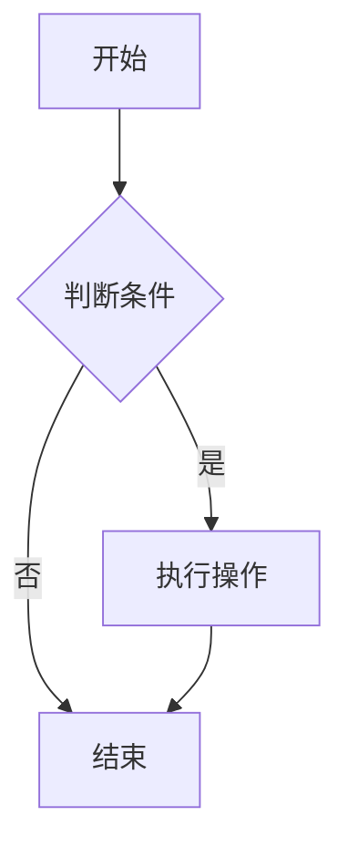
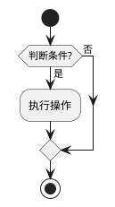
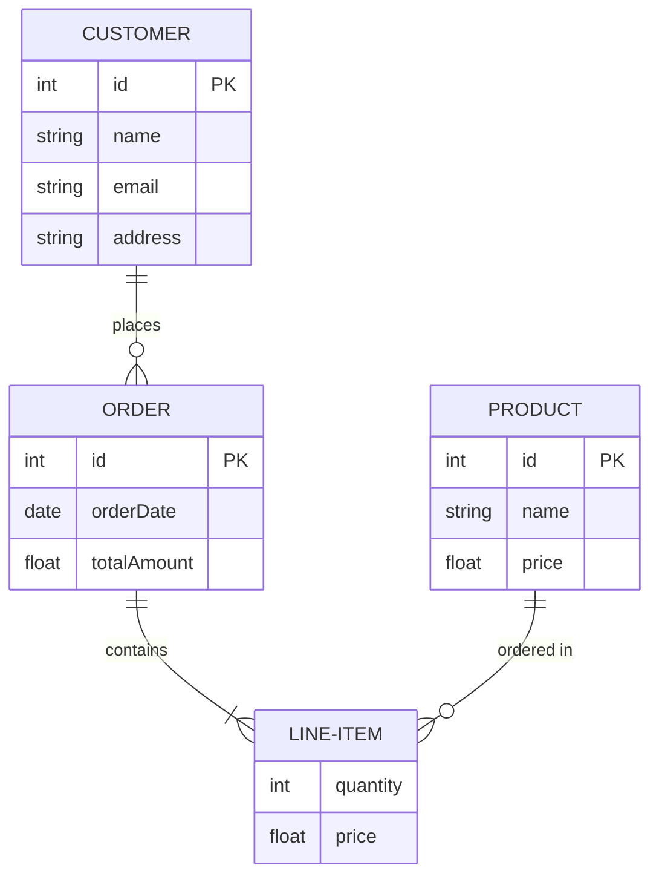
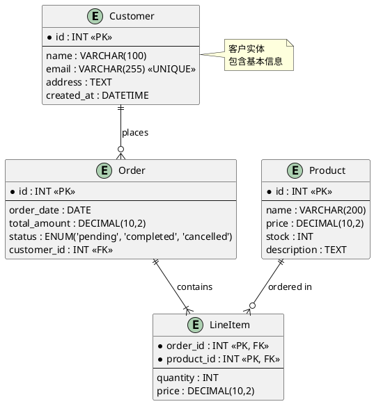
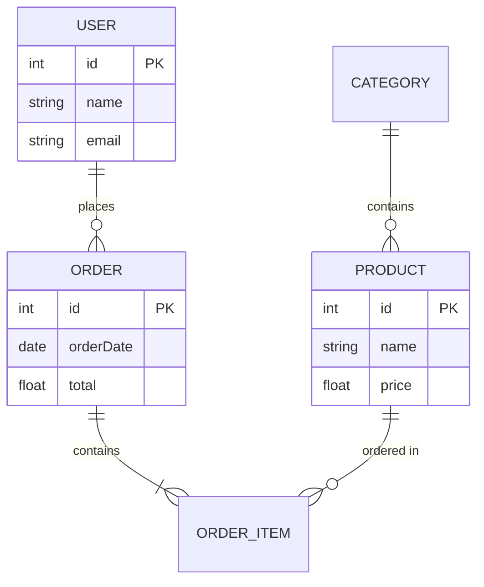
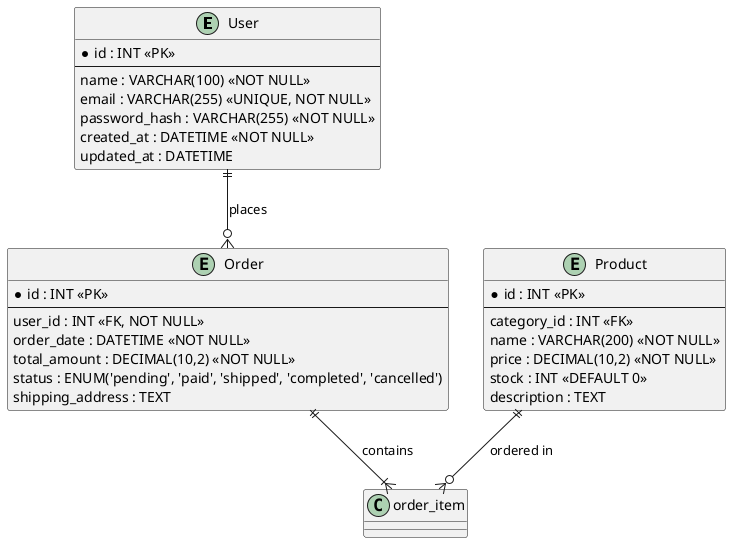
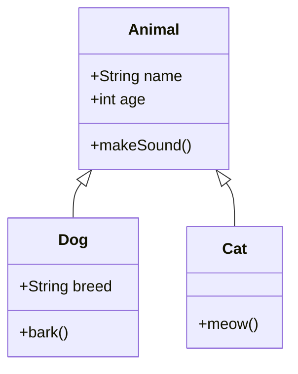
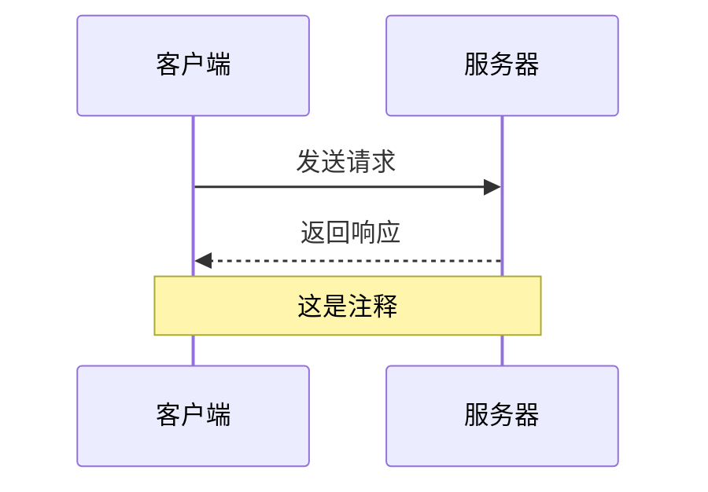
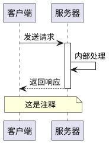

# Mermaid vs PlantUML 全面对比

本文档从多个维度对比 Mermaid 和 PlantUML，帮助您在不同场景下选择最合适的图表工具。

## 📊 快速对比表

| 维度              | Mermaid                 | PlantUML               |
| ----------------- | ----------------------- | ---------------------- |
| **语法风格**      | 简洁直观，类似 Markdown | 更接近传统 UML，更严谨 |
| **学习曲线**      | ⭐⭐ 较平缓             | ⭐⭐⭐ 稍陡峭          |
| **图表类型**      | 15+ 种常用图表          | 20+ 种，UML 更全面     |
| **渲染方式**      | 客户端/服务端 JS        | 服务端 Java（需 JVM）  |
| **Markdown 集成** | ✅ 原生支持             | ⚠️ 需要插件            |
| **GitHub/GitLab** | ✅ 原生支持             | ❌ 不支持              |
| **实时预览**      | ✅ 优秀                 | ⚠️ 需要工具            |
| **文件大小**      | 轻量（JS 库）           | 较重（Java 依赖）      |
| **自定义样式**    | ⚠️ 有限                 | ✅ 强大                |
| **复杂 UML**      | ⚠️ 基础支持             | ✅ 完整支持            |

---

## 🔍 详细维度对比

### 1. 语法易用性

#### Mermaid



**特点：**

- ✅ 语法简洁，类似 Markdown
- ✅ 直观易懂，上手快
- ✅ 代码可读性强
- ⚠️ 复杂场景语法可能冗长

#### PlantUML



**特点：**

- ✅ 更符合 UML 标准
- ✅ 语法严谨，适合复杂场景
- ⚠️ 学习曲线稍陡
- ⚠️ 需要 `@startuml/@enduml` 标记

**结论：** Mermaid 在易用性上更胜一筹，特别适合快速绘制简单图表。

---

### 2. 图表类型支持

#### Mermaid 支持的图表类型

1. ✅ 流程图 (Flowchart)
2. ✅ 序列图 (Sequence Diagram)
3. ✅ 类图 (Class Diagram) - 基础
4. ✅ 状态图 (State Diagram)
5. ✅ 实体关系图 (ER Diagram)
6. ✅ 用户旅程图 (User Journey)
7. ✅ 甘特图 (Gantt Chart)
8. ✅ 饼图 (Pie Chart)
9. ✅ Git 图 (Git Graph)
10. ✅ 需求图 (Requirement Diagram)
11. ✅ C4 图（通过插件）
12. ✅ 时间线图 (Timeline)
13. ✅ 思维导图 (Mindmap)
14. ✅ 象限图 (Quadrant Chart)
15. ✅ 看板图 (Kanban)

#### PlantUML 支持的图表类型

1. ✅ 类图 (Class Diagram) - **完整 UML**
2. ✅ 序列图 (Sequence Diagram) - **完整 UML**
3. ✅ 用例图 (Use Case Diagram)
4. ✅ 活动图 (Activity Diagram)
5. ✅ 组件图 (Component Diagram)
6. ✅ 部署图 (Deployment Diagram)
7. ✅ 状态图 (State Diagram) - **完整 UML**
8. ✅ 对象图 (Object Diagram)
9. ✅ 时序图 (Timing Diagram)
10. ✅ 包图 (Package Diagram)
11. ✅ 网络图 (Network Diagram)
12. ✅ 架构图 (Archimate)
13. ✅ 甘特图 (Gantt Chart)
14. ✅ 思维导图 (Mindmap)
15. ✅ WBS 图 (Work Breakdown Structure)
16. ✅ JSON/YAML 可视化
17. ✅ 数据库 ER 图
18. ✅ C4 图
19. ✅ 盐堆图 (Salt)
20. ✅ 更多...

**结论：** PlantUML 在 UML 图表类型上更全面，特别是复杂的企业级 UML 图表。

---

### 3. 数据库 ER 图对比（重要差异）

#### Mermaid ER 图示例



**特点：**

- ✅ **语法简洁直观** - 类似 Markdown，易于上手
- ✅ **关系表示清晰** - 使用 `||--o{` 等符号表示关系类型
- ✅ **支持属性定义** - 可以在实体中定义字段和主键（PK）
- ✅ **快速绘制** - 适合快速原型和简单到中等复杂度的 ER 图
- ⚠️ **功能相对基础** - 不支持复杂约束、索引、外键详细定义
- ⚠️ **样式自定义有限** - 主要通过主题控制
- ⚠️ **不支持反向工程** - 无法从数据库自动生成

**关系类型：**

- `||--o{` : 一对多（One to Many）
- `||--||` : 一对一（One to One）
- `}o--o{` : 多对多（Many to Many）
- `||--o|` : 一对零或一（One to Zero or One）

#### PlantUML ER 图示例



**特点：**

- ✅ **功能强大** - 支持完整的数据库设计元素
- ✅ **详细约束支持** - 支持主键（PK）、外键（FK）、唯一约束（UNIQUE）、索引等
- ✅ **数据类型完整** - 支持各种数据库数据类型（INT、VARCHAR、TEXT、DECIMAL、ENUM 等）
- ✅ **注释和说明** - 支持添加注释和说明
- ✅ **样式自定义** - 可以自定义颜色、字体、布局
- ✅ **反向工程支持** - 可以通过插件从数据库生成 ER 图
- ⚠️ **语法相对复杂** - 学习曲线较陡
- ⚠️ **需要 Java 环境** - 需要 JVM 运行

**支持的数据库特性：**

- ✅ 主键（Primary Key）
- ✅ 外键（Foreign Key）
- ✅ 唯一约束（Unique）
- ✅ 索引（Index）
- ✅ 数据类型（各种 SQL 类型）
- ✅ 枚举类型（ENUM）
- ✅ 注释和说明
- ✅ 关系基数（1:1, 1:N, N:M）

#### 详细功能对比

| 功能特性           | Mermaid                      | PlantUML              |
| ------------------ | ---------------------------- | --------------------- |
| **基本实体和属性** | ✅ 支持                      | ✅ 支持               |
| **关系类型**       | ✅ 基础支持（1:1, 1:N, N:M） | ✅ 完整支持           |
| **主键标记**       | ✅ 支持（PK）                | ✅ 支持（<<PK>>）     |
| **外键标记**       | ⚠️ 有限支持                  | ✅ 完整支持（<<FK>>） |
| **唯一约束**       | ❌ 不支持                    | ✅ 支持（<<UNIQUE>>） |
| **索引定义**       | ❌ 不支持                    | ✅ 支持（<<INDEX>>）  |
| **数据类型**       | ⚠️ 基础类型                  | ✅ 完整 SQL 类型      |
| **枚举类型**       | ❌ 不支持                    | ✅ 支持（ENUM）       |
| **注释说明**       | ⚠️ 有限                      | ✅ 完整支持           |
| **样式自定义**     | ⚠️ 主题控制                  | ✅ 强大自定义         |
| **反向工程**       | ❌ 不支持                    | ✅ 支持（通过插件）   |
| **语法简洁度**     | ✅ 非常简洁                  | ⚠️ 相对复杂           |
| **学习曲线**       | ⭐⭐ 平缓                    | ⭐⭐⭐ 较陡           |

#### 使用场景建议

**选择 Mermaid ER 图 ✅**

适合以下场景：

1. **快速原型设计**

   - 快速绘制数据库概念模型
   - 团队讨论和沟通
   - 文档中的简单 ER 图

2. **简单到中等复杂度**

   - 实体数量较少（< 20 个）
   - 关系相对简单
   - 不需要详细的约束定义

3. **文档集成**

   - GitHub/GitLab README
   - 飞书云文档
   - Markdown 技术文档
   - 在线文档系统

4. **快速迭代**
   - 需要频繁修改和更新
   - 团队协作编辑
   - 实时预览

**示例场景：**

- ✅ 项目文档中的数据库概览图
- ✅ API 文档中的数据模型说明
- ✅ 技术博客中的数据库设计介绍
- ✅ 快速概念设计

**选择 PlantUML ER 图 ✅**

适合以下场景：

1. **完整数据库设计**

   - 企业级数据库设计
   - 需要详细约束定义
   - 完整的数据库规范

2. **复杂数据库结构**

   - 实体数量多（> 20 个）
   - 复杂的关系和约束
   - 需要详细的字段定义

3. **正式设计文档**

   - 数据库设计文档
   - 系统设计文档
   - 需要打印的文档

4. **反向工程**
   - 从现有数据库生成 ER 图
   - 数据库结构分析
   - 数据库迁移文档

**示例场景：**

- ✅ 企业级系统的完整数据库设计
- ✅ 需要详细约束和索引的数据库设计
- ✅ 从现有数据库生成 ER 图
- ✅ 正式的技术设计文档

#### 实际示例对比

**场景：电商系统数据库设计**

**Mermaid 版本（简洁）：**



**PlantUML 版本（详细）：**



**结论：**

- **简单快速** → 选择 **Mermaid**
- **详细完整** → 选择 **PlantUML**

---

### 4. 类图对比（重要差异）

#### Mermaid 类图示例



**限制：**

- ⚠️ 不支持接口（Interface）
- ⚠️ 不支持抽象类标记
- ⚠️ 关系类型有限
- ⚠️ 不支持泛型
- ⚠️ 不支持包（Package）分组

#### PlantUML 类图示例

```plantuml
@startuml
abstract class Animal {
    +String name
    +int age
    {abstract} +makeSound()
}

interface Flyable {
    +fly()
}

class Dog extends Animal {
    +String breed
    +bark()
}

class Bird extends Animal implements Flyable {
    +fly()
}

class Cat extends Animal {
    +meow()
}

package "com.example" {
    Animal
    Dog
}
@enduml
```

**优势：**

- ✅ 完整 UML 2.0 支持
- ✅ 接口、抽象类、枚举
- ✅ 泛型支持：`List<String>`
- ✅ 包（Package）分组
- ✅ 关系类型丰富（继承、实现、组合、聚合、依赖等）
- ✅ 可见性标记完整（+、-、#、~）
- ✅ 注释和约束

**结论：** 如果需要绘制标准的 UML 类图，PlantUML 是更好的选择。

---

### 4. 序列图对比

#### Mermaid 序列图



**特点：**

- ✅ 语法简洁
- ✅ 支持参与者别名
- ✅ 支持注释和分组
- ⚠️ 复杂交互可能不够灵活

#### PlantUML 序列图



**特点：**

- ✅ 支持激活框（activate/deactivate）
- ✅ 支持生命线片段（alt/opt/loop）
- ✅ 更符合 UML 标准
- ✅ 支持更多交互模式

**结论：** 简单序列图两者都很好，复杂交互 PlantUML 更强大。

---

### 5. 集成和部署

#### Mermaid

**优势：**

- ✅ **GitHub/GitLab 原生支持** - 直接在 README 中渲染
- ✅ **Markdown 原生支持** - 大多数 Markdown 编辑器支持
- ✅ **飞书云文档支持** - 可直接插入 Mermaid 代码块，支持流程图、序列图、甘特图等
- ✅ **客户端渲染** - 无需服务器，浏览器直接渲染
- ✅ **轻量级** - 只需引入 JS 库（~200KB）
- ✅ **实时预览** - VS Code、Typora 等工具支持
- ✅ **在线编辑器** - [mermaid.live](https://mermaid.live/)

**部署方式：**

```html
<!-- 简单引入 -->
<script src="https://cdn.jsdelivr.net/npm/mermaid/dist/mermaid.min.js"></script>
<script>
  mermaid.initialize({ startOnLoad: true });
</script>
```

**飞书云文档使用方法：**

1. 在飞书文档中，点击「插入」菜单
2. 选择「代码块」或直接输入 `/代码块`
3. 在代码块中选择语言为 `mermaid`
4. 输入 Mermaid 语法代码，图表会自动渲染

**支持的平台：**

- ✅ GitHub/GitLab - 原生支持
- ✅ 飞书云文档 - 原生支持
- ✅ Notion - 原生支持
- ✅ Obsidian - 原生支持
- ✅ VS Code - 通过插件支持
- ✅ Typora - 原生支持

#### PlantUML

**限制：**

- ❌ **GitHub/GitLab 不支持** - 需要转换为图片或使用插件
- ⚠️ **需要 Java 环境** - 依赖 JVM
- ⚠️ **服务端渲染** - 需要服务器或本地工具
- ⚠️ **Markdown 集成** - 需要插件（如 VS Code 的 PlantUML 插件）

**部署方式：**

```bash
# 需要安装 Java 和 PlantUML
java -jar plantuml.jar diagram.puml
```

**在线服务：**

- [PlantUML Server](http://www.plantuml.com/plantuml/uml/) - 需要网络请求

**结论：** Mermaid 在集成和部署上更简单，特别是对于 Markdown 文档和 GitHub 项目。

---

### 6. 渲染和性能

#### Mermaid

- ✅ **客户端渲染** - 浏览器直接渲染，响应快
- ✅ **SVG 输出** - 矢量图，可缩放
- ✅ **交互支持** - 可以添加点击事件
- ⚠️ **复杂图表** - 大型图表可能渲染较慢

#### PlantUML

- ✅ **服务端渲染** - 服务器端生成，客户端只需显示图片
- ✅ **多种输出格式** - PNG、SVG、PDF、EPS 等
- ✅ **图片质量高** - 适合打印和文档
- ⚠️ **需要服务器** - 或本地 Java 环境

**结论：** Mermaid 适合在线文档和实时预览，PlantUML 适合生成高质量图片。

---

### 7. 自定义和扩展

#### Mermaid

- ⚠️ **样式自定义有限** - 主要通过主题和 CSS
- ⚠️ **扩展性一般** - 主要依赖官方更新
- ✅ **主题支持** - 内置多个主题（default、dark、forest 等）

```javascript
mermaid.initialize({
  theme: "dark",
  themeVariables: {
    primaryColor: "#ff0000",
  },
});
```

#### PlantUML

- ✅ **强大的样式系统** - 可以自定义颜色、字体、布局
- ✅ **皮肤（Skin）支持** - 丰富的皮肤库
- ✅ **脚本支持** - 可以编写脚本扩展功能

```plantuml
!define RECTANGLE class
skinparam class {
    BackgroundColor LightBlue
    BorderColor DarkBlue
}
```

**结论：** PlantUML 在自定义和扩展上更强大。

---

### 8. 社区和生态

#### Mermaid

- ✅ **活跃的社区** - GitHub 70k+ stars
- ✅ **广泛采用** - GitHub、GitLab、Notion、Obsidian 等
- ✅ **持续更新** - 定期发布新功能
- ✅ **丰富的文档** - 官方文档完善

#### PlantUML

- ✅ **成熟稳定** - 开发多年，功能完善
- ✅ **企业级应用** - 广泛用于企业文档
- ✅ **丰富的示例** - 大量社区示例
- ⚠️ **更新频率** - 相对较慢，但稳定

**结论：** 两者都有活跃的社区，Mermaid 更现代，PlantUML 更成熟。

---

## 🎯 使用场景建议

### 选择 Mermaid 的场景 ✅

1. **Markdown 文档和 README**

   - GitHub/GitLab 项目文档
   - 技术博客文章
   - 在线文档系统

2. **快速原型和草图**

   - 快速绘制流程图
   - 思维导图
   - 简单的架构图

3. **实时协作和预览**

   - VS Code 实时预览
   - 在线编辑器
   - 团队协作文档

4. **前端项目集成**

   - 文档网站（VuePress、Docusaurus）
   - 博客系统
   - 在线工具

5. **简单到中等复杂度的图表**

   - 流程图、序列图
   - 状态图
   - 甘特图

6. **简单到中等复杂度的 ER 图**
   - 快速数据库概念设计
   - 文档中的数据库概览
   - 简单的实体关系图（< 20 个实体）

**示例场景：**

- ✅ 项目 README 中的架构图
- ✅ 技术文档中的流程图
- ✅ 博客文章中的图表
- ✅ 简单的系统设计图
- ✅ 飞书云文档中的技术文档和流程图
- ✅ 项目文档中的简单数据库 ER 图
- ✅ API 文档中的数据模型说明

### 选择 PlantUML 的场景 ✅

1. **标准 UML 建模**

   - 企业级系统设计
   - 完整的类图设计
   - 复杂的 UML 图表

2. **需要高质量图片输出**

   - 打印文档
   - PDF 报告
   - 正式的技术文档

3. **复杂的系统架构**

   - 组件图、部署图
   - 包图、用例图
   - 多层次的架构图

4. **企业级文档**

   - 需求文档
   - 设计文档
   - 系统文档

5. **需要精确控制样式**

   - 公司标准模板
   - 品牌色彩要求
   - 特定格式要求

6. **复杂的数据库 ER 图**
   - 企业级数据库设计
   - 需要详细约束和索引定义
   - 从现有数据库反向生成 ER 图
   - 完整的数据库设计文档

**示例场景：**

- ✅ 企业级系统的完整 UML 设计
- ✅ 需要打印的技术文档
- ✅ 复杂的类图（接口、泛型、包等）
- ✅ 标准化的企业文档
- ✅ 企业级数据库的完整 ER 图设计
- ✅ 需要详细约束定义的数据库设计
- ✅ 从现有数据库生成 ER 图

---

## 💡 混合使用策略

实际上，您可以根据不同需求混合使用两者：

### 策略 1：文档用 Mermaid，设计用 PlantUML

- **文档和 README** → Mermaid（GitHub 原生支持）
- **正式设计文档** → PlantUML（完整 UML）

### 策略 2：简单用 Mermaid，复杂用 PlantUML

- **简单流程图、序列图** → Mermaid
- **复杂类图、组件图** → PlantUML

### 策略 3：在线用 Mermaid，离线用 PlantUML

- **在线文档、实时预览** → Mermaid
- **离线文档、PDF 生成** → PlantUML

---

## 📝 迁移建议

### 从 PlantUML 迁移到 Mermaid

- ✅ 适合：简单图表、Markdown 文档
- ⚠️ 注意：复杂 UML 功能可能不支持
- 🔧 工具：可以手动转换或使用转换工具

### 从 Mermaid 迁移到 PlantUML

- ✅ 适合：需要完整 UML 支持
- ⚠️ 注意：需要 Java 环境和服务器
- 🔧 工具：可以手动转换，语法差异较大

---

## 🎓 学习资源

### Mermaid

- 📖 [官方文档](https://mermaid.js.org/)
- 🎨 [在线编辑器](https://mermaid.live/)
- 📚 [GitHub 仓库](https://github.com/mermaid-js/mermaid)

### PlantUML

- 📖 [官方文档](https://plantuml.com/)
- 🎨 [在线服务器](http://www.plantuml.com/plantuml/uml/)
- 📚 [GitHub 仓库](https://github.com/plantuml/plantuml)

---

## 🔄 针对本项目的建议

基于您的项目（xiaozhi-esp32）当前使用 Mermaid 的情况：

### 当前使用 Mermaid 的优势 ✅

1. ✅ GitHub 原生支持，文档可直接查看
2. ✅ Markdown 集成简单，维护方便
3. ✅ 实时预览，开发体验好
4. ✅ 图表类型已满足需求（流程图、序列图、状态图、类图）

### 是否需要切换到 PlantUML？

**建议保持 Mermaid**，原因：

- ✅ 当前图表复杂度适中，Mermaid 已足够
- ✅ GitHub 原生支持，文档可读性好
- ✅ 团队协作更方便（无需 Java 环境）
- ✅ 维护成本更低

### 何时考虑 PlantUML？

如果未来需要：

- ⚠️ 绘制更复杂的 UML 类图（接口、泛型、包等）
- ⚠️ 生成高质量打印文档
- ⚠️ 符合企业级 UML 标准

可以考虑在特定文档中使用 PlantUML，但建议保持主要文档使用 Mermaid。

---

## 📊 总结对比

| 场景            | 推荐工具     | 理由                 |
| --------------- | ------------ | -------------------- |
| GitHub README   | **Mermaid**  | 原生支持，无需转换   |
| 飞书云文档      | **Mermaid**  | 原生支持，可直接插入 |
| 技术博客        | **Mermaid**  | Markdown 集成简单    |
| 简单流程图      | **Mermaid**  | 语法简洁，上手快     |
| **简单 ER 图**  | **Mermaid**  | 语法简洁，快速绘制   |
| **复杂 ER 图**  | **PlantUML** | 完整约束和详细定义   |
| 企业级 UML 设计 | **PlantUML** | 完整 UML 支持        |
| 复杂类图        | **PlantUML** | 接口、泛型、包等支持 |
| 打印文档        | **PlantUML** | 高质量图片输出       |
| 实时预览        | **Mermaid**  | 客户端渲染，响应快   |
| 在线文档系统    | **Mermaid**  | 轻量级，易于集成     |

---

**最后建议：** 对于大多数项目，Mermaid 已经足够。只有在需要完整 UML 标准或高质量图片输出时，才考虑 PlantUML。
